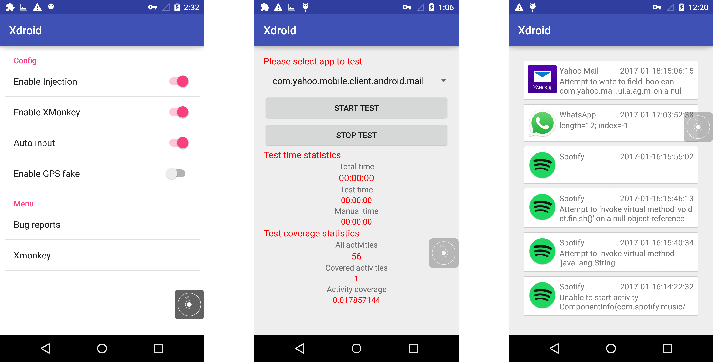

## Xdroid
Xdroid provides a convenient float window to start/stop the test process and users can access the window at everywhere on the device screen. It makes toasts with information and plays a ring tone to inform users to offer help. What's more, Xdroid implements a plain UI to configure the behavior of Xdroid and review test reports.

### Float window and notifications


### Main function UI



## Experiment setup
Since automated testing can not provide the resources that apps depend on, manual testing is expensive and cannot effectively detect bugs as random testing. We conduct experiments to evaluate if Xdroid can combine the benefits of both manual testing and random testing to increase test efficiency.

We evaluated Xdroid with two other effective approaches in this study: manual testing and Monkey test tool provided by Android. For manual testing and Xdroid, we invited five users to help with the process of test and all five users we chose in this study are students at Nanjing University who have experience using Android apps.

## List of apps
We selected 12 commercial apps which are used by millions of users from [Google play top charts](https://play.google.com/store/apps/top) and 8 open-source apps from the Android open-source apps repository [F-Droid](https://f-droid.org/). The number of activities listed in the AndroidManifest file of these apps ranges from 7 to 705, with a mean of 100. The SLOC of open source apps ranges from 1k to 21K, with a mean of 8K.


## Code coverage results for open-source apps

|Subject       |               |	   |	  |	   | Monkey |	| 	| Xdroid |	|           | 	| Manual	|    |     | Sapienz	| | |
| ------       | --------      |--- |--- |--- |--- |--- |--- |--- |--- |--- |--- |--- |--- |--- |--- |--- |--- |
|Subject Name	 | Category      |	#Activity	| App pkg	| Version	| Cov |	#ANR	| #Crash	| Manual(min) |	Cov	| #ANR	 | #Crash	| Cov	| #ANR	| #Crash | Cov	| #ANR	| #Crash |
|AnyMemo       |	Education	   | 35	| org.liberty.android.fantastischmemo	| 8.3.1 |	25.32 |	0	|1	|3	|27.21 |	1	| 1	| 35.92 |	0	| 1 | 5.59 | 0 | 0 |
|BookCatalogue |	Productivity | 22	| com.eleybourn.bookcatalogue	| 3.8	| 18.45 |	0	| 1	| 4	 |43.13 |	0	|2	| 43.32 |	0	|0|3.15 | 0 | 0 |
|Mileage	     |  Finance	     | 51	| com.evancharlton.mileage	|3.1.1	|	23.22 |	0	|0	|3	| 55.08 |	0	|3	|53.68 |	0	|2|20.68  | 0 | 0 |
|Multi SMS	   |  Tools        |	7	|com.hectorone.multismssender	|2.3	| 41.33 |	0	|0	|3	| 66.34 |	0	|0	|65.57 |	0|	0| 29.18 | 0 | 0 |
|Nectroid      |	Media	       |7|	com.kvance.Nectroid|	1.2.4	| 31.64 |	0	|0	|2.5	| 	50.66 |	0	|1	|60.33 |	0|	1| 26.53 | 0 | 0 |
|MyExpenses	   |  Finance      |	13|	org.totschnig.myexpenses|	1.6.0|	20.77 |	0	|0	|2.5|		38.05 |	0	|1	|56.19 |	0|	0| 17.65 | 0 | 0 |
|K-9Mail       |	Mail         |	25	|com.fsck.k9|	3.512| 5.06 |	0	|1	|6|		30.87 |	0	|4	|	32.49 |	0	|1| 2.42 | 0 | 0 |
|KeePassDroid  |	Tools        |	15|	com.android.keepass|	1.9.8	| 5.02 |	0	|0 | 3	|	11.32 |	0 |	1 | 8.78 | 0 |0| 1.94 | 0 | 0 |


## Activity coverage results for commercial apps

|Subject |  |	|	|	| Monkey |	| 	| Xdroid |	|           | 	| Manual	| | | Sapienz		| | |
| ---- | --- |--- |--- |--- |--- |--- |--- |--- |--- |--- |--- |--- |--- |--- |--- |--- |--- |
|Subject Name	| Category |	#Activity	| App pkg	| Version	| Cov |	#ANR	| #Crash	| Manual(min) |	Cov	| #ANR	 | #Crash	| Cov	| #ANR	| #Crash | Cov	| #ANR	| #Crash |
|wish        |	Shopping	    | 49	| com.contextlogic.wish	  | 4.2.1             |	12.24 |	0	| 0	| 5	|	30.61 |	0	| 0	| 	42.85 |	0	| 0 | 12.24  | 0 | 0 |
|Messenger   |	Communication | 121	| com.facebook.orca	      |33.0.0.31.250	    |	1.24 	| 0	|0	|	6	| 19.00  |	0	| 0	|19.80  | 	0	|0| 1.60  | 0 | 0 |
|instagram   |  Media	        | 26	| com.instagram.android	  |10.3.0	 	          | 11.50 |	0	|0	|	3	| 26.92  |	0 |	0	|	34.61 | 	0	|0| 11.53 | 0 | 0 |
|pinterest   |  Media         |	34	| com.pinterest	          |6.6.0	            |	8.82 	| 0	|0	|	6 | 22.06  |	0 |	1	|	39.70 |	0	|0|8.82 | 0 | 0 |
|snapchat    |	Communication	|  9  |	com.snapchat.android    |8.0.0	            |	22.22 |	0	|0	| 2 | 44.44  |	0	| 0	| 44.44 |	0	|0|22.22 | 0 | 0 |
|spotify	   |  Media         |	97  |	com.spotify.music       |7.0.0.1.1369		    | 4.64 	| 0	|0	| 7 | 15.46  |  0	| 3 |	17.52 |	0	|1|5.15 | 0 | 0 |
|Wechat      |  Social        |	705	| com.fsck.k9             |6.3.32	 	          | 0.57 	| 1	|0	|	5 | 8.22   |	0	| 0	| 12.40 | 0 |	0| 1.27  | 0 | 0 |
|twitter     |	Social        |	176 |	com.twitter.android     |6.28.0	 	          | 2.27 	| 0	|0	|	5	| 27.27  |	1 | 0	|	31.25 |	0	|0|4.54 | 0 | 2 |
|facebook    |	Social        |	418 |	com.facebook.katana     |106.0.0.26.68      | 1.43 	| 1	|0	| 4 | 6.34   | 	0	| 4 |	8.13  | 0 |	0| 1.67  | 0 | 0 |
|Google      |	Tools         |	25  |	com.google.android.apps.translate | 5.6.0   | 38.00 |	0	|0	|	6	| 52.00  |	0	| 0	|52.00 	| 0	|0|40.00 | 0 | 0 |
|whatsapp    |	Communication |	122 |	com.whatsapp            |	2.16.396	 	      | 2.86  |	0	|0	|	4	| 28.68  |	0	| 1	|40.16  | 0 |	0|1.63 |0 | 0 |
|yahoo mail  |	Mail          |	56  |	com.yahoo.mobile.client.android.mail|5.11.6 | 10.71 | 0	|0	|	5	| 30.35	 |	0	| 1	| 35.71 |	0	|0|
7.14 | 0 | 0 |


## Bugs Found

| Subject     |    Bugs  |
| ---         |    ---   |
| Manual      |     6    |
| Monkey      |     5    |
| Xdroid      |     26   |
| Sapienz     |     2    |


### Xdroid：26 Bugs
**Yahoo Mail** : 1

```
java.lang.NullPointerException: Attempt to write to field 'boolean com.yahoo.mail.ui.a.ag.m' on a null object reference
	at com.yahoo.mail.ui.fragments.gj.V(Yahoo:8154)
	at com.yahoo.mail.a.g.onItemClick(Yahoo:10374)
	at android.widget.AdapterView.performItemClick(AdapterView.java:300)
	at android.widget.AbsListView.performItemClick(AbsListView.java:1143)
	at android.widget.AbsListView.onKeyUp(AbsListView.java:3185)
	at android.widget.ListView.commonKey(ListView.java:2300)
	at android.widget.ListView.onKeyUp(ListView.java:2155)
	at android.view.KeyEvent.dispatch(KeyEvent.java:2633)
	at android.view.View.dispatchKeyEvent(View.java:8338)
	at android.view.ViewGroup.dispatchKeyEvent(ViewGroup.java:1595)
	at android.widget.ListView.dispatchKeyEvent(ListView.java:2130)
	at android.view.ViewGroup.dispatchKeyEvent(ViewGroup.java:1600)
	at android.view.ViewGroup.dispatchKeyEvent(ViewGroup.java:1600)
	at android.view.ViewGroup.dispatchKeyEvent(ViewGroup.java:1600)
	at android.view.ViewGroup.dispatchKeyEvent(ViewGroup.java:1600)
	at android.view.ViewGroup.dispatchKeyEvent(ViewGroup.java:1600)
	at android.view.ViewGroup.dispatchKeyEvent(ViewGroup.java:1600)
	at android.view.ViewGroup.dispatchKeyEvent(ViewGroup.java:1600)
	at com.android.internal.policy.impl.PhoneWindow$DecorView.superDispatchKeyEvent(PhoneWindow.java:2306)
	at com.android.internal.policy.impl.PhoneWindow.superDispatchKeyEvent(PhoneWindow.java:1682)
	at android.app.Activity.dispatchKeyEvent(Activity.java:2699)
	at android.support.v7.a.w.dispatchKeyEvent(Yahoo:547)
	at android.support.v7.view.n.dispatchKeyEvent(Yahoo:57)
	at android.support.v7.a.ab.dispatchKeyEvent(Yahoo:315)
	at com.android.internal.policy.impl.PhoneWindow$DecorView.dispatchKeyEvent(PhoneWindow.java:2221)
	at android.view.ViewRootImpl$ViewPostImeInputStage.processKeyEvent(ViewRootImpl.java:3918)
	at android.view.ViewRootImpl$ViewPostImeInputStage.onProcess(ViewRootImpl.java:3880)
	at android.view.ViewRootImpl$InputStage.deliver(ViewRootImpl.java:3449)
	at android.view.ViewRootImpl$InputStage.onDeliverToNext(ViewRootImpl.java:3502)
	at android.view.ViewRootImpl$InputStage.forward(ViewRootImpl.java:3468)
	at android.view.ViewRootImpl$AsyncInputStage.forward(ViewRootImpl.java:3578)
	at android.view.ViewRootImpl$InputStage.apply(ViewRootImpl.java:3476)
	at android.view.ViewRootImpl$AsyncInputStage.apply(ViewRootImpl.java:3635)
	at android.view.ViewRootImpl$InputStage.deliver(ViewRootImpl.java:3449)
	at android.view.ViewRootImpl$InputStage.onDeliverToNext(ViewRootImpl.java:3502)
	at android.view.ViewRootImpl$InputStage.forward(ViewRootImpl.java:3468)
	at android.view.ViewRootImpl$InputStage.apply(ViewRootImpl.java:3476)
	at android.view.ViewRootImpl$InputStage.deliver(ViewRootImpl.java:3449)
	at android.view.ViewRootImpl$InputStage.onDeliverToNext(ViewRootImpl.java:3502)
	at android.view.ViewRootImpl$InputStage.forward(ViewRootImpl.java:3468)
	at android.view.ViewRootImpl$AsyncInputStage.forward(ViewRootImpl.java:3611)
	at android.view.ViewRootImpl$ImeInputStage.onFinishedInputEvent(ViewRootImpl.java:3772)
	at android.view.inputmethod.InputMethodManager$PendingEvent.run(InputMethodManager.java:2208)
	at android.view.inputmethod.InputMethodManager.invokeFinishedInputEventCallback(InputMethodManager.java:1849)
	at android.view.inputmethod.InputMethodManager.finishedInputEvent(InputMethodManager.java:1840)
	at android.view.inputmethod.InputMethodManager$ImeInputEventSender.onInputEventFinished(InputMethodManager.java:2185)
	at android.view.InputEventSender.dispatchInputEventFinished(InputEventSender.java:141)
	at android.os.MessageQueue.nativePollOnce(Native Method)
	at android.os.MessageQueue.next(MessageQueue.java:143)
	at android.os.Looper.loop(Looper.java:122)
	at android.app.ActivityThread.main(ActivityThread.java:5221)
	at java.lang.reflect.Method.invoke(Native Method)
	at java.lang.reflect.Method.invoke(Method.java:372)
	at com.android.internal.os.ZygoteInit$MethodAndArgsCaller.run(ZygoteInit.java:899)
	at com.android.internal.os.ZygoteInit.main(ZygoteInit.java:694)
	at de.robv.android.xposed.XposedBridge.main(XposedBridge.java:102)
```

**whatsapp**：1

```
java.lang.ArrayIndexOutOfBoundsException: length=12; index=-1
	at java.util.ArrayList.get(ArrayList.java:310)
	at com.whatsapp.ContactPicker$b.a(ContactPicker.java:2080)
	at com.whatsapp.dw.onItemClick(Unknown Source);
	at android.widget.AdapterView.performItemClick(AdapterView.java:300)
	at android.widget.AbsListView.performItemClick(AbsListView.java:1143)
	at android.widget.AbsListView.onKeyUp(AbsListView.java:3185)
	at android.widget.ListView.commonKey(ListView.java:2300)
	at android.widget.ListView.onKeyUp(ListView.java:2155)
	at android.view.KeyEvent.dispatch(KeyEvent.java:2633)
	at android.view.View.dispatchKeyEvent(View.java:8338)
	at android.view.ViewGroup.dispatchKeyEvent(ViewGroup.java:1595)
	at android.widget.ListView.dispatchKeyEvent(ListView.java:2130)
	at android.view.ViewGroup.dispatchKeyEvent(ViewGroup.java:1600)
	at android.view.ViewGroup.dispatchKeyEvent(ViewGroup.java:1600)
	at android.view.ViewGroup.dispatchKeyEvent(ViewGroup.java:1600)
	at android.view.ViewGroup.dispatchKeyEvent(ViewGroup.java:1600)
	at android.view.ViewGroup.dispatchKeyEvent(ViewGroup.java:1600)
	at android.view.ViewGroup.dispatchKeyEvent(ViewGroup.java:1600)
	at android.view.ViewGroup.dispatchKeyEvent(ViewGroup.java:1600)
	at android.view.ViewGroup.dispatchKeyEvent(ViewGroup.java:1600)
	at com.android.internal.policy.impl.PhoneWindow$DecorView.superDispatchKeyEvent(PhoneWindow.java:2306)
	at com.android.internal.policy.impl.PhoneWindow.superDispatchKeyEvent(PhoneWindow.java:1682)
	at android.app.Activity.dispatchKeyEvent(Activity.java:2699)
	at android.support.v7.view.i.dispatchKeyEvent(WindowCallbackWrapper.java:50)
	at android.support.v7.a.g$a.dispatchKeyEvent(AppCompatDelegateImplBase.java:224)
	at android.support.v7.view.i.dispatchKeyEvent(WindowCallbackWrapper.java:50)
	at com.android.internal.policy.impl.PhoneWindow$DecorView.dispatchKeyEvent(PhoneWindow.java:2221)
	at android.view.ViewRootImpl$ViewPostImeInputStage.processKeyEvent(ViewRootImpl.java:3918)
	at android.view.ViewRootImpl$ViewPostImeInputStage.onProcess(ViewRootImpl.java:3880)
	at android.view.ViewRootImpl$InputStage.deliver(ViewRootImpl.java:3449)
	at android.view.ViewRootImpl$InputStage.onDeliverToNext(ViewRootImpl.java:3502)
	at android.view.ViewRootImpl$InputStage.forward(ViewRootImpl.java:3468)
	at android.view.ViewRootImpl$AsyncInputStage.forward(ViewRootImpl.java:3578)
	at android.view.ViewRootImpl$InputStage.apply(ViewRootImpl.java:3476)
	at android.view.ViewRootImpl$AsyncInputStage.apply(ViewRootImpl.java:3635)
	at android.view.ViewRootImpl$InputStage.deliver(ViewRootImpl.java:3449)
	at android.view.ViewRootImpl$InputStage.onDeliverToNext(ViewRootImpl.java:3502)
	at android.view.ViewRootImpl$InputStage.forward(ViewRootImpl.java:3468)
	at android.view.ViewRootImpl$InputStage.apply(ViewRootImpl.java:3476)
	at android.view.ViewRootImpl$InputStage.deliver(ViewRootImpl.java:3449)
	at android.view.ViewRootImpl$InputStage.onDeliverToNext(ViewRootImpl.java:3502)
	at android.view.ViewRootImpl$InputStage.forward(ViewRootImpl.java:3468)
	at android.view.ViewRootImpl$AsyncInputStage.forward(ViewRootImpl.java:3611)
	at android.view.ViewRootImpl$ImeInputStage.onFinishedInputEvent(ViewRootImpl.java:3772)
	at android.view.inputmethod.InputMethodManager$PendingEvent.run(InputMethodManager.java:2208)
	at android.view.inputmethod.InputMethodManager.invokeFinishedInputEventCallback(InputMethodManager.java:1849)
	at android.view.inputmethod.InputMethodManager.finishedInputEvent(InputMethodManager.java:1840)
	at android.view.inputmethod.InputMethodManager$ImeInputEventSender.onInputEventFinished(InputMethodManager.java:2185)
	at android.view.InputEventSender.dispatchInputEventFinished(InputEventSender.java:141)
	at android.os.MessageQueue.nativePollOnce(Native Method)
	at android.os.MessageQueue.next(MessageQueue.java:143)
	at android.os.Looper.loop(Looper.java:122)
	at android.app.ActivityThread.main(ActivityThread.java:5221)
	at java.lang.reflect.Method.invoke(Native Method)
	at java.lang.reflect.Method.invoke(Method.java:372)
	at com.android.internal.os.ZygoteInit$MethodAndArgsCaller.run(ZygoteInit.java:899)
	at com.android.internal.os.ZygoteInit.main(ZygoteInit.java:694)
	at de.robv.android.xposed.XposedBridge.main(XposedBridge.java:102)
```

* **spotify**: 3

```
java.lang.IllegalStateException
	at dnk.b(SourceFile:159)
	at com.spotify.mobile.android.spotlets.player.FullscreenOverlayResolver.a(SourceFile:142)
	at hnh.a(SourceFile:21094)
	at hpw.a(SourceFile:1585)
	at com.spotify.mobile.android.spotlets.lyrics.view.LyricsScrollerView$2.onClick(SourceFile:141)
	at android.view.View.performClick(View.java:4756)
	at android.view.View.onKeyUp(View.java:8935)
	at android.widget.TextView.onKeyUp(TextView.java:5883)
	at android.view.KeyEvent.dispatch(KeyEvent.java:2633)
	at android.view.View.dispatchKeyEvent(View.java:8338)
	at android.view.ViewGroup.dispatchKeyEvent(ViewGroup.java:1600)
	at android.view.ViewGroup.dispatchKeyEvent(ViewGroup.java:1600)
	at android.view.ViewGroup.dispatchKeyEvent(ViewGroup.java:1600)
	at android.view.ViewGroup.dispatchKeyEvent(ViewGroup.java:1600)
	at android.view.ViewGroup.dispatchKeyEvent(ViewGroup.java:1600)
	at android.view.ViewGroup.dispatchKeyEvent(ViewGroup.java:1600)
	at android.view.ViewGroup.dispatchKeyEvent(ViewGroup.java:1600)
	at android.view.ViewGroup.dispatchKeyEvent(ViewGroup.java:1600)
	at android.view.ViewGroup.dispatchKeyEvent(ViewGroup.java:1600)
	at android.view.ViewGroup.dispatchKeyEvent(ViewGroup.java:1600)
	at android.view.ViewGroup.dispatchKeyEvent(ViewGroup.java:1600)
	at android.view.ViewGroup.dispatchKeyEvent(ViewGroup.java:1600)
	at android.view.ViewGroup.dispatchKeyEvent(ViewGroup.java:1600)
	at android.view.ViewGroup.dispatchKeyEvent(ViewGroup.java:1600)
	at android.view.ViewGroup.dispatchKeyEvent(ViewGroup.java:1600)
	at android.view.ViewGroup.dispatchKeyEvent(ViewGroup.java:1600)
	at com.android.internal.policy.impl.PhoneWindow$DecorView.superDispatchKeyEvent(PhoneWindow.java:2306)
	at com.android.internal.policy.impl.PhoneWindow.superDispatchKeyEvent(PhoneWindow.java:1682)
	at android.app.Activity.dispatchKeyEvent(Activity.java:2699)
	at zt.dispatchKeyEvent(SourceFile:533)
	at afx.dispatchKeyEvent(SourceFile:53)
	at zy.dispatchKeyEvent(SourceFile:254)
	at com.android.internal.policy.impl.PhoneWindow$DecorView.dispatchKeyEvent(PhoneWindow.java:2221)
	at android.view.ViewRootImpl$ViewPostImeInputStage.processKeyEvent(ViewRootImpl.java:3918)
	at android.view.ViewRootImpl$ViewPostImeInputStage.onProcess(ViewRootImpl.java:3880)
	at android.view.ViewRootImpl$InputStage.deliver(ViewRootImpl.java:3449)
	at android.view.ViewRootImpl$InputStage.onDeliverToNext(ViewRootImpl.java:3502)
	at android.view.ViewRootImpl$InputStage.forward(ViewRootImpl.java:3468)
	at android.view.ViewRootImpl$AsyncInputStage.forward(ViewRootImpl.java:3578)
	at android.view.ViewRootImpl$InputStage.apply(ViewRootImpl.java:3476)
	at android.view.ViewRootImpl$AsyncInputStage.apply(ViewRootImpl.java:3635)
	at android.view.ViewRootImpl$InputStage.deliver(ViewRootImpl.java:3449)
	at android.view.ViewRootImpl$InputStage.onDeliverToNext(ViewRootImpl.java:3502)
	at android.view.ViewRootImpl$InputStage.forward(ViewRootImpl.java:3468)
	at android.view.ViewRootImpl$InputStage.apply(ViewRootImpl.java:3476)
	at android.view.ViewRootImpl$InputStage.deliver(ViewRootImpl.java:3449)
	at android.view.ViewRootImpl$InputStage.onDeliverToNext(ViewRootImpl.java:3502)
	at android.view.ViewRootImpl$InputStage.forward(ViewRootImpl.java:3468)
	at android.view.ViewRootImpl$AsyncInputStage.forward(ViewRootImpl.java:3611)
	at android.view.ViewRootImpl$ImeInputStage.onFinishedInputEvent(ViewRootImpl.java:3772)
	at android.view.inputmethod.InputMethodManager$PendingEvent.run(InputMethodManager.java:2208)
	at android.view.inputmethod.InputMethodManager.invokeFinishedInputEventCallback(InputMethodManager.java:1849)
	at android.view.inputmethod.InputMethodManager.finishedInputEvent(InputMethodManager.java:1840)
	at android.view.inputmethod.InputMethodManager$ImeInputEventSender.onInputEventFinished(InputMethodManager.java:2185)
	at android.view.InputEventSender.dispatchInputEventFinished(InputEventSender.java:141)
	at android.os.MessageQueue.nativePollOnce(Native Method)
	at android.os.MessageQueue.next(MessageQueue.java:143)
	at android.os.Looper.loop(Looper.java:122)
	at android.app.ActivityThread.main(ActivityThread.java:5221)
	at java.lang.reflect.Method.invoke(Native Method)
	at java.lang.reflect.Method.invoke(Method.java:372)
	at com.android.internal.os.ZygoteInit$MethodAndArgsCaller.run(ZygoteInit.java:899)
	at com.android.internal.os.ZygoteInit.main(ZygoteInit.java:694)
	at de.robv.android.xposed.XposedBridge.main(XposedBridge.java:102)
```

```
 java.lang.NullPointerException: Attempt to invoke virtual method 'void et.finish()' on a null object reference
	at iyq.a(SourceFile:175)
	at com.spotify.mobile.android.spotlets.slate.container.view.SlateView.a(SourceFile:192)
	at com.spotify.mobile.android.spotlets.slate.container.view.card.CardInteractionHandler$1.onAnimationEnd(SourceFile:43)
	at android.view.ViewPropertyAnimator$AnimatorEventListener.onAnimationEnd(ViewPropertyAnimator.java:1116)
	at android.animation.ValueAnimator.endAnimation(ValueAnimator.java:1089)
	at android.animation.ValueAnimator$AnimationHandler.doAnimationFrame(ValueAnimator.java:666)
	at android.animation.ValueAnimator$AnimationHandler.run(ValueAnimator.java:682)
	at android.view.Choreographer$CallbackRecord.run(Choreographer.java:767)
	at android.view.Choreographer.doCallbacks(Choreographer.java:580)
	at android.view.Choreographer.doFrame(Choreographer.java:549)
	at android.view.Choreographer$FrameDisplayEventReceiver.run(Choreographer.java:753)
	at android.os.Handler.handleCallback(Handler.java:739)
	at android.os.Handler.dispatchMessage(Handler.java:95)
	at android.os.Looper.loop(Looper.java:135)
	at android.app.ActivityThread.main(ActivityThread.java:5221)
	at java.lang.reflect.Method.invoke(Native Method)
	at java.lang.reflect.Method.invoke(Method.java:372)
	at com.android.internal.os.ZygoteInit$MethodAndArgsCaller.run(ZygoteInit.java:899)
	at com.android.internal.os.ZygoteInit.main(ZygoteInit.java:694)
	at de.robv.android.xposed.XposedBridge.main(XposedBridge.java:102)
```

```
java.lang.NullPointerException: Attempt to invoke virtual method 'java.lang.String org.json.JSONObject.optString(java.lang.String)' on a null object reference
	at fye.a(SourceFile:293)
	at com.facebook.GraphRequest$1.a(SourceFile:304)
	at com.facebook.GraphRequest$2.run(SourceFile:1379)
	at android.os.Handler.handleCallback(Handler.java:739)
	at android.os.Handler.dispatchMessage(Handler.java:95)
	at android.os.Looper.loop(Looper.java:135)
	at android.app.ActivityThread.main(ActivityThread.java:5221)
	at java.lang.reflect.Method.invoke(Native Method)
	at java.lang.reflect.Method.invoke(Method.java:372)
	at com.android.internal.os.ZygoteInit$MethodAndArgsCaller.run(ZygoteInit.java:899)
	at com.android.internal.os.ZygoteInit.main(ZygoteInit.java:694)
	at de.robv.android.xposed.XposedBridge.main(XposedBridge.java:102)
```

* **twitter**：1

```
ANR: com.android.location.fusedInput dispatching timed out (Waiting because no window has focus but there is a focused application that may eventually add a window when it finishes starting up.)
```

* **facebook**: 4

```
java.lang.NullPointerException: Attempt to invoke virtual method 'java.lang.Object android.content.Context.getSystemService(java.lang.String)' on a null object reference
	at android.view.ContextThemeWrapper.getSystemService(ContextThemeWrapper.java:113)
	at X.0ht.<init>(:119012)
	at X.0hs.<init>(:118761)
	at X.0hs.<init>(:118786)
	at com.facebook.devicebasedlogin.ui.DBLAccountsListVerticalFragment$1.run(:2371275)
	at android.os.Handler.handleCallback(Handler.java:739)
	at android.os.Handler.dispatchMessage(Handler.java:95)
	at android.os.Looper.loop(Looper.java:135)
	at android.app.ActivityThread.main(ActivityThread.java:5221)
	at java.lang.reflect.Method.invoke(Native Method)
	at java.lang.reflect.Method.invoke(Method.java:372)
	at com.android.internal.os.ZygoteInit$MethodAndArgsCaller.run(ZygoteInit.java:899)
	at com.android.internal.os.ZygoteInit.main(ZygoteInit.java:694)
	at de.robv.android.xposed.XposedBridge.main(XposedBridge.java:102)
```

```
java.lang.NullPointerException: Attempt to invoke virtual method 'void X.E8m.a(X.9qT)' on a null object reference
	at com.facebook.reaction.ui.fragment.BaseReactionFragment.a(:2082686)
	at com.facebook.reaction.ui.fragment.BaseReactionFragment.kL_(:2082511)
	at com.facebook.pages.common.surface.fragments.reaction.PagesGenericReactionSurfaceTabFragment.kL_(:2461385)
	at X.2j6.a(:452722)
	at X.2j6.a(:452662)
	at X.2j7.a(:452758)
	at X.2jH.b(:452803)
	at X.0b4.a(:86584)
	at X.Cfb.onSuccessfulResult(:1926449)
	at X.0Vd.onSuccess(:67970)
	at com.google.common.util.concurrent.Futures$6.run(:68028)
	at java.util.concurrent.Executors$RunnableAdapter.call(Executors.java:422)
	at com.facebook.common.executors.WrappingExecutorService$1.run(:77498)
	at android.os.Handler.handleCallback(Handler.java:739)
	at android.os.Handler.dispatchMessage(Handler.java:95)
	at android.os.Looper.loop(Looper.java:135)
	at android.app.ActivityThread.main(ActivityThread.java:5221)
	at java.lang.reflect.Method.invoke(Native Method)
	at java.lang.reflect.Method.invoke(Method.java:372)
	at com.android.internal.os.ZygoteInit$MethodAndArgsCaller.run(ZygoteInit.java:899)
	at com.android.internal.os.ZygoteInit.main(ZygoteInit.java:694)
	at de.robv.android.xposed.XposedBridge.main(XposedBridge.java:102)
```

```
java.lang.ClassCastException: X.Ewl cannot be cast to X.2lq
	at com.facebook.friending.center.tabs.requests.FriendsCenterRequestsFragment.a(:2183353)
	at X.2hD.onItemClick(:449901)
	at android.widget.AdapterView.performItemClick(AdapterView.java:300)
	at android.widget.AbsListView.performItemClick(AbsListView.java:1143)
	at com.facebook.widget.listview.BetterListView.performItemClick(:274999)
	at android.widget.AbsListView.onKeyUp(AbsListView.java:3185)
	at android.widget.ListView.commonKey(ListView.java:2300)
	at android.widget.ListView.onKeyUp(ListView.java:2155)
	at android.view.KeyEvent.dispatch(KeyEvent.java:2633)
	at android.view.View.dispatchKeyEvent(View.java:8338)
	at android.view.ViewGroup.dispatchKeyEvent(ViewGroup.java:1595)
	at android.widget.ListView.dispatchKeyEvent(ListView.java:2130)
	at android.view.ViewGroup.dispatchKeyEvent(ViewGroup.java:1600)
	at android.view.ViewGroup.dispatchKeyEvent(ViewGroup.java:1600)
	at android.view.ViewGroup.dispatchKeyEvent(ViewGroup.java:1600)
	at android.support.v4.view.ViewPager.dispatchKeyEvent(:116467)
	at android.view.ViewGroup.dispatchKeyEvent(ViewGroup.java:1600)
	at android.view.ViewGroup.dispatchKeyEvent(ViewGroup.java:1600)
	at android.view.ViewGroup.dispatchKeyEvent(ViewGroup.java:1600)
	at android.view.ViewGroup.dispatchKeyEvent(ViewGroup.java:1600)
	at android.view.ViewGroup.dispatchKeyEvent(ViewGroup.java:1600)
	at android.view.ViewGroup.dispatchKeyEvent(ViewGroup.java:1600)
	at android.view.ViewGroup.dispatchKeyEvent(ViewGroup.java:1600)
	at com.android.internal.policy.impl.PhoneWindow$DecorView.superDispatchKeyEvent(PhoneWindow.java:2306)
	at com.android.internal.policy.impl.PhoneWindow.superDispatchKeyEvent(PhoneWindow.java:1682)
	at android.app.Activity.dispatchKeyEvent(Activity.java:2699)
	at com.facebook.base.activity.DelegatingFbFragmentFrameworkActivity.a(:375341)
	at X.42h.a(:667732)
	at X.42i.a(:667877)
	at com.facebook.base.activity.DelegatingFbFragmentFrameworkActivity.dispatchKeyEvent(:375266)
	at com.android.internal.policy.impl.PhoneWindow$DecorView.dispatchKeyEvent(PhoneWindow.java:2221)
	at android.view.ViewRootImpl$ViewPostImeInputStage.processKeyEvent(ViewRootImpl.java:3918)
	at android.view.ViewRootImpl$ViewPostImeInputStage.onProcess(ViewRootImpl.java:3880)
	at android.view.ViewRootImpl$InputStage.deliver(ViewRootImpl.java:3449)
	at android.view.ViewRootImpl$InputStage.onDeliverToNext(ViewRootImpl.java:3502)
	at android.view.ViewRootImpl$InputStage.forward(ViewRootImpl.java:3468)
	at android.view.ViewRootImpl$AsyncInputStage.forward(ViewRootImpl.java:3578)
	at android.view.ViewRootImpl$InputStage.apply(ViewRootImpl.java:3476)
	at android.view.ViewRootImpl$AsyncInputStage.apply(ViewRootImpl.java:3635)
	at android.view.ViewRootImpl$InputStage.deliver(ViewRootImpl.java:3449)
	at android.view.ViewRootImpl$InputStage.onDeliverToNext(ViewRootImpl.java:3502)
	at android.view.ViewRootImpl$InputStage.forward(ViewRootImpl.java:3468)
	at android.view.ViewRootImpl$InputStage.apply(ViewRootImpl.java:3476)
	at android.view.ViewRootImpl$InputStage.deliver(ViewRootImpl.java:3449)
	at android.view.ViewRootImpl$InputStage.onDeliverToNext(ViewRootImpl.java:3502)
	at android.view.ViewRootImpl$InputStage.forward(ViewRootImpl.java:3468)
	at android.view.ViewRootImpl$AsyncInputStage.forward(ViewRootImpl.java:3611)
	at android.view.ViewRootImpl$ImeInputStage.onFinishedInputEvent(ViewRootImpl.java:3772)
	at android.view.inputmethod.InputMethodManager$PendingEvent.run(InputMethodManager.java:2208)
	at android.view.inputmethod.InputMethodManager.invokeFinishedInputEventCallback(InputMethodManager.java:1849)
	at android.view.inputmethod.InputMethodManager.finishedInputEvent(InputMethodManager.java:1840)
	at android.view.inputmethod.InputMethodManager$ImeInputEventSender.onInputEventFinished(InputMethodManager.java:2185)
	at android.view.InputEventSender.dispatchInputEventFinished(InputEventSender.java:141)
	at android.os.MessageQueue.nativePollOnce(Native Method)
	at android.os.MessageQueue.next(MessageQueue.java:143)
	at android.os.Looper.loop(Looper.java:122)
	at android.app.ActivityThread.main(ActivityThread.java:5221)
	at java.lang.reflect.Method.invoke(Native Method)
	at java.lang.reflect.Method.invoke(Method.java:372)
	at com.android.internal.os.ZygoteInit$MethodAndArgsCaller.run(ZygoteInit.java:899)
	at com.android.internal.os.ZygoteInit.main(ZygoteInit.java:694)
	at de.robv.android.xposed.XposedBridge.main(XposedBridge.java:102)
```
```
java.lang.IllegalStateException: Unhandled: a
	at X.FXV.a(:2255141)
	at X.FXi.a(:2255329)
	at X.AUB.a(:1677804)
	at X.0k7.b(:126257)
	at X.0k7.a(:126300)
	at X.0k9.b(:126353)
	at X.AUG.a(:1677909)
	at X.AUG.b(:1677885)
	at X.AUE.a$redex0(:1677850)
	at com.facebook.crudolib.dbquery.loader.inprocess.ExecutorLoader$PostResultRunnable.run(:1677825)
	at android.os.Handler.handleCallback(Handler.java:739)
	at android.os.Handler.dispatchMessage(Handler.java:95)
	at android.os.Looper.loop(Looper.java:135)
	at android.app.ActivityThread.main(ActivityThread.java:5221)
	at java.lang.reflect.Method.invoke(Native Method)
	at java.lang.reflect.Method.invoke(Method.java:372)
	at com.android.internal.os.ZygoteInit$MethodAndArgsCaller.run(ZygoteInit.java:899)
	at com.android.internal.os.ZygoteInit.main(ZygoteInit.java:694)
	at de.robv.android.xposed.XposedBridge.main(XposedBridge.java:102)
```

* **printerest**:1

```
java.lang.RuntimeException: Unable to pause activity {com.pinterest/com.pinterest.activity.create.CameraActivity}: java.lang.RuntimeException: setParameters failed
	at android.app.ActivityThread.performPauseActivity(ActivityThread.java:3225)
	at android.app.ActivityThread.performPauseActivity(ActivityThread.java:3184)
	at android.app.ActivityThread.handlePauseActivity(ActivityThread.java:3159)
	at android.app.ActivityThread.access$1000(ActivityThread.java:144)
	at android.app.ActivityThread$H.handleMessage(ActivityThread.java:1296)
	at android.os.Handler.dispatchMessage(Handler.java:102)
	at android.os.Looper.loop(Looper.java:135)
	at android.app.ActivityThread.main(ActivityThread.java:5221)
	at java.lang.reflect.Method.invoke(Native Method)
	at java.lang.reflect.Method.invoke(Method.java:372)
	at com.android.internal.os.ZygoteInit$MethodAndArgsCaller.run(ZygoteInit.java:899)
	at com.android.internal.os.ZygoteInit.main(ZygoteInit.java:694)
	at de.robv.android.xposed.XposedBridge.main(XposedBridge.java:102)
Caused by: java.lang.RuntimeException: setParameters failed
	at android.hardware.Camera.native_setParameters(Native Method)
	at android.hardware.Camera.setParameters(Camera.java:1876)
	at com.pinterest.ui.camera.CameraManager.disableFlash(SourceFile:394)
	at com.pinterest.ui.camera.CameraManager.closeCamera(SourceFile:361)
	at com.pinterest.activity.create.CameraActivity.onPause(SourceFile:125)
	at android.app.Activity.performPause(Activity.java:6044)
	at android.app.Instrumentation.callActivityOnPause(Instrumentation.java:1294)
	at android.app.ActivityThread.performPauseActivity(ActivityThread.java:3211)
	at android.app.ActivityThread.performPauseActivity(ActivityThread.java:3184)
	at android.app.ActivityThread.handlePauseActivity(ActivityThread.java:3159)
	at android.app.ActivityThread.access$1000(ActivityThread.java:144)
	at android.app.ActivityThread$H.handleMessage(ActivityThread.java:1296)
	at android.os.Handler.dispatchMessage(Handler.java:102)
	at android.os.Looper.loop(Looper.java:135)
	at android.app.ActivityThread.main(ActivityThread.java:5221)
	at java.lang.reflect.Method.invoke(Native Method)
	at java.lang.reflect.Method.invoke(Method.java:372)
	at com.android.internal.os.ZygoteInit$MethodAndArgsCaller.run(ZygoteInit.java:899)
	at com.android.internal.os.ZygoteInit.main(ZygoteInit.java:694)
	at de.robv.android.xposed.XposedBridge.main(XposedBridge.java:102)
```

* **necdroid**:1

```
    12-20 14:20:43.770 I/Xposed  (15769): java.lang.UnsatisfiedLinkError: dalvik.system.PathClassLoader[DexPathList[[zip file "/data/app/com.kvance.Nectroid-1/base.apk"],nativeLibraryDirectories=[/vendor/lib, /system/lib]]] couldn't find "libmp3streamer.so"
    12-20 14:20:43.770 I/Xposed  (15769): 	at java.lang.Runtime.loadLibrary(Runtime.java:366)
    12-20 14:20:43.770 I/Xposed  (15769): 	at java.lang.System.loadLibrary(System.java:989)
    12-20 14:20:43.770 I/Xposed  (15769): 	at com.kvance.Nectroid.MP3Streamer.<clinit>(MP3Streamer.java:400)
    12-20 14:20:43.770 I/Xposed  (15769): 	at com.kvance.Nectroid.PlayerService.startPlaying(PlayerService.java:261)
    12-20 14:20:43.770 I/Xposed  (15769): 	at com.kvance.Nectroid.PlayerService.handleCommand(PlayerService.java:240)
    12-20 14:20:43.770 I/Xposed  (15769): 	at com.kvance.Nectroid.ForegroundService.onStartCommand(ForegroundService.java:149)
    12-20 14:20:43.770 I/Xposed  (15769): 	at android.app.ActivityThread.handleServiceArgs(ActivityThread.java:2864)
    12-20 14:20:43.770 I/Xposed  (15769): 	at android.app.ActivityThread.access$2100(ActivityThread.java:144)
    12-20 14:20:43.770 I/Xposed  (15769): 	at android.app.ActivityThread$H.handleMessage(ActivityThread.java:1376)
    12-20 14:20:43.770 I/Xposed  (15769): 	at android.os.Handler.dispatchMessage(Handler.java:102)
    12-20 14:20:43.770 I/Xposed  (15769): 	at android.os.Looper.loop(Looper.java:135)
    12-20 14:20:43.770 I/Xposed  (15769): 	at android.app.ActivityThread.main(ActivityThread.java:5221)
    12-20 14:20:43.770 I/Xposed  (15769): 	at java.lang.reflect.Method.invoke(Native Method)
    12-20 14:20:43.770 I/Xposed  (15769): 	at java.lang.reflect.Method.invoke(Method.java:372)
    12-20 14:20:43.770 I/Xposed  (15769): 	at com.android.internal.os.ZygoteInit$MethodAndArgsCaller.run(ZygoteInit.java:899)
    12-20 14:20:43.770 I/Xposed  (15769): 	at com.android.internal.os.ZygoteInit.main(ZygoteInit.java:694)
    12-20 14:20:43.770 I/Xposed  (15769): 	at de.robv.android.xposed.XposedBridge.main(XposedBridge.java:102)
    12-20 14:20:43.775 I/Xposed  (15769): URL construct https://www.scenemusic.net/demovibes/xml/queue/
```

* **com.evancharlton.mileage**:3

```
  java.lang.RuntimeException: Unable to start activity ComponentInfo{com.evancharlton.mileage/com.evancharlton.mileage.charts.MinimumDistanceChart}: java.lang.IllegalArgumentException: Point already added to series
	at android.app.ActivityThread.performLaunchActivity(ActivityThread.java:2298)
	at android.app.ActivityThread.handleLaunchActivity(ActivityThread.java:2360)
	at android.app.ActivityThread.handleRelaunchActivity(ActivityThread.java:3912)
	at android.app.ActivityThread.access$900(ActivityThread.java:144)
	at android.app.ActivityThread$H.handleMessage(ActivityThread.java:1284)
	at android.os.Handler.dispatchMessage(Handler.java:102)
	at android.os.Looper.loop(Looper.java:135)
	at android.app.ActivityThread.main(ActivityThread.java:5221)
	at java.lang.reflect.Method.invoke(Native Method)
	at java.lang.reflect.Method.invoke(Method.java:372)
	at com.android.internal.os.ZygoteInit$MethodAndArgsCaller.run(ZygoteInit.java:899)
	at com.android.internal.os.ZygoteInit.main(ZygoteInit.java:694)
	at de.robv.android.xposed.XposedBridge.main(XposedBridge.java:102)
Caused by: java.lang.IllegalArgumentException: Point already added to series
	at com.artfulbits.aiCharts.Base.ChartPointCollection.add(Unknown Source)
	at com.evancharlton.mileage.charts.LineChart.unserializeData(LineChart.java:63)
	at com.evancharlton.mileage.ChartActivity.restoreLastNonConfigurationInstance(ChartActivity.java:72)
	at com.evancharlton.mileage.ChartActivity.onCreate(ChartActivity.java:36)
	at android.app.Activity.performCreate(Activity.java:5933)
	at android.app.Instrumentation.callActivityOnCreate(Instrumentation.java:1105)
	at android.app.ActivityThread.performLaunchActivity(ActivityThread.java:2251)
	at android.app.ActivityThread.handleLaunchActivity(ActivityThread.java:2360)
	at android.app.ActivityThread.handleRelaunchActivity(ActivityThread.java:3912)
	at android.app.ActivityThread.access$900(ActivityThread.java:144)
	at android.app.ActivityThread$H.handleMessage(ActivityThread.java:1284)
	at android.os.Handler.dispatchMessage(Handler.java:102)
	at android.os.Looper.loop(Looper.java:135)
	at android.app.ActivityThread.main(ActivityThread.java:5221)
	at java.lang.reflect.Method.invoke(Native Method)
	at java.lang.reflect.Method.invoke(Method.java:372)
	at com.android.internal.os.ZygoteInit$MethodAndArgsCaller.run(ZygoteInit.java:899)
	at com.android.internal.os.ZygoteInit.main(ZygoteInit.java:694)
	at de.robv.android.xposed.XposedBridge.main(XposedBridge.java:102)
```

```
  android.content.ActivityNotFoundException: No Activity found to handle Intent { act=android.intent.action.VIEW dat=mailto:xxxxxxx@xxxxxxxxxxxx.xxx (has extras) }
	at android.app.Instrumentation.checkStartActivityResult(Instrumentation.java:1765)
	at android.app.Instrumentation.execStartActivity(Instrumentation.java:1485)
	at android.app.Activity.startActivityForResult(Activity.java:3736)
	at android.app.Activity.startActivityForResult(Activity.java:3697)
	at de.robv.android.xposed.XposedBridge.invokeOriginalMethodNative(Native Method)
	at de.robv.android.xposed.XposedBridge.handleHookedMethod(XposedBridge.java:334)
	at android.app.Activity.startActivityForResult(<Xposed>)
	at android.app.Activity.startActivity(Activity.java:4007)
	at android.app.Activity.startActivity(Activity.java:3975)
	at android.text.style.URLSpan.onClick(URLSpan.java:62)
	at android.text.method.LinkMovementMethod.action(LinkMovementMethod.java:140)
	at android.text.method.LinkMovementMethod.handleMovementKey(LinkMovementMethod.java:50)
	at android.text.method.BaseMovementMethod.onKeyDown(BaseMovementMethod.java:42)
	at android.widget.TextView.doKeyDown(TextView.java:5814)
	at android.widget.TextView.onKeyDown(TextView.java:5600)
	at android.view.KeyEvent.dispatch(KeyEvent.java:2609)
	at android.view.View.dispatchKeyEvent(View.java:8338)
	at android.view.ViewGroup.dispatchKeyEvent(ViewGroup.java:1600)
	at android.view.ViewGroup.dispatchKeyEvent(ViewGroup.java:1600)
	at android.widget.ScrollView.dispatchKeyEvent(ScrollView.java:369)
	at android.view.ViewGroup.dispatchKeyEvent(ViewGroup.java:1600)
	at android.view.ViewGroup.dispatchKeyEvent(ViewGroup.java:1600)
	at android.view.ViewGroup.dispatchKeyEvent(ViewGroup.java:1600)
	at android.view.ViewGroup.dispatchKeyEvent(ViewGroup.java:1600)
	at com.android.internal.policy.impl.PhoneWindow$DecorView.superDispatchKeyEvent(PhoneWindow.java:2306)
	at com.android.internal.policy.impl.PhoneWindow.superDispatchKeyEvent(PhoneWindow.java:1682)
	at android.app.Activity.dispatchKeyEvent(Activity.java:2699)
	at com.android.internal.policy.impl.PhoneWindow$DecorView.dispatchKeyEvent(PhoneWindow.java:2221)
	at android.view.ViewRootImpl$ViewPostImeInputStage.processKeyEvent(ViewRootImpl.java:3918)
	at android.view.ViewRootImpl$ViewPostImeInputStage.onProcess(ViewRootImpl.java:3880)
	at android.view.ViewRootImpl$InputStage.deliver(ViewRootImpl.java:3449)
	at android.view.ViewRootImpl$InputStage.onDeliverToNext(ViewRootImpl.java:3502)
	at android.view.ViewRootImpl$InputStage.forward(ViewRootImpl.java:3468)
	at android.view.ViewRootImpl$AsyncInputStage.forward(ViewRootImpl.java:3578)
	at android.view.ViewRootImpl$InputStage.apply(ViewRootImpl.java:3476)
	at android.view.ViewRootImpl$AsyncInputStage.apply(ViewRootImpl.java:3635)
	at android.view.ViewRootImpl$InputStage.deliver(ViewRootImpl.java:3449)
	at android.view.ViewRootImpl$InputStage.onDeliverToNext(ViewRootImpl.java:3502)
	at android.view.ViewRootImpl$InputStage.forward(ViewRootImpl.java:3468)
	at android.view.ViewRootImpl$InputStage.apply(ViewRootImpl.java:3476)
	at android.view.ViewRootImpl$InputStage.deliver(ViewRootImpl.java:3449)
	at android.view.ViewRootImpl$InputStage.onDeliverToNext(ViewRootImpl.java:3502)
	at android.view.ViewRootImpl$InputStage.forward(ViewRootImpl.java:3468)
	at android.view.ViewRootImpl$AsyncInputStage.forward(ViewRootImpl.java:3611)
	at android.view.ViewRootImpl$ImeInputStage.onFinishedInputEvent(ViewRootImpl.java:3772)
	at android.view.inputmethod.InputMethodManager$PendingEvent.run(InputMethodManager.java:2208)
	at android.view.inputmethod.InputMethodManager.invokeFinishedInputEventCallback(InputMethodManager.java:1849)
	at android.view.inputmethod.InputMethodManager.finishedInputEvent(InputMethodManager.java:1840)
	at android.view.inputmethod.InputMethodManager$ImeInputEventSender.onInputEventFinished(InputMethodManager.java:2185)
	at android.view.InputEventSender.dispatchInputEventFinished(InputEventSender.java:141)
	at android.os.MessageQueue.nativePollOnce(Native Method)
	at android.os.MessageQueue.next(MessageQueue.java:143)
	at android.os.Looper.loop(Looper.java:122)
	at android.app.ActivityThread.main(ActivityThread.java:5221)
	at java.lang.reflect.Method.invoke(Native Method)
	at java.lang.reflect.Method.invoke(Method.java:372)
	at com.android.internal.os.ZygoteInit$MethodAndArgsCaller.run(ZygoteInit.java:899)
	at com.android.internal.os.ZygoteInit.main(ZygoteInit.java:694)
	at de.robv.android.xposed.XposedBridge.main(XposedBridge.java:102)
```

```
    java.lang.NumberFormatException: Invalid long: "  22=="
    	at java.lang.Long.invalidLong(Long.java:124)
    	at java.lang.Long.parse(Long.java:363)
    	at java.lang.Long.parseLong(Long.java:353)
    	at java.lang.Long.parseLong(Long.java:321)
    	at com.evancharlton.mileage.views.DeltaView.getDelta(DeltaView.java:63)
    	at com.evancharlton.mileage.ServiceIntervalTemplateActivity.setFields(ServiceIntervalTemplateActivity.java:83)
    	at com.evancharlton.mileage.BaseFormActivity$1.onClick(BaseFormActivity.java:53)
    	at android.view.View.performClick(View.java:4756)
    	at android.view.View$PerformClick.run(View.java:19749)
    	at android.os.Handler.handleCallback(Handler.java:739)
    	at android.os.Handler.dispatchMessage(Handler.java:95)
    	at android.os.Looper.loop(Looper.java:135)
    	at android.app.ActivityThread.main(ActivityThread.java:5221)
    	at java.lang.reflect.Method.invoke(Native Method)
    	at java.lang.reflect.Method.invoke(Method.java:372)
    	at com.android.internal.os.ZygoteInit$MethodAndArgsCaller.run(ZygoteInit.java:899)
    	at com.android.internal.os.ZygoteInit.main(ZygoteInit.java:694)
    	at de.robv.android.xposed.XposedBridge.main(XposedBridge.java:102)
```

* **org.liberty.android.fantastischmemo**:3

```
  android.view.WindowManager$BadTokenException: Unable to add window -- token android.os.BinderProxy@25efe8ae is not valid; is your activity running?
    	at android.view.ViewRootImpl.setView(ViewRootImpl.java:562)
    	at android.view.WindowManagerGlobal.addView(WindowManagerGlobal.java:272)
    	at android.view.WindowManagerImpl.addView(WindowManagerImpl.java:69)
    	at android.app.Dialog.show(Dialog.java:298)
    	at org.liberty.android.fantastischmemo.downloader.DownloaderAnyMemo$2$2.run(DownloaderAnyMemo.java:127)
    	at android.os.Handler.handleCallback(Handler.java:739)
    	at android.os.Handler.dispatchMessage(Handler.java:95)
    	at android.os.Looper.loop(Looper.java:135)
    	at android.app.ActivityThread.main(ActivityThread.java:5221)
    	at java.lang.reflect.Method.invoke(Native Method)
    	at java.lang.reflect.Method.invoke(Method.java:372)
    	at com.android.internal.os.ZygoteInit$MethodAndArgsCaller.run(ZygoteInit.java:899)
    	at com.android.internal.os.ZygoteInit.main(ZygoteInit.java:694)
    	at de.robv.android.xposed.XposedBridge.main(XposedBridge.java:102)
```

```
 12-12 09:45:43.186 24826-24891/? E/ActivityManager: ANR in org.liberty.android.fantastischmemo (org.liberty.android.fantastischmemo/.downloader.DropboxLauncher)
                                                        PID: 6635
                                                        Reason: Input dispatching timed out (Waiting to send key event because the focused window has not finished processing all of the input events that were previously delivered to it.  dd
```

```
java.lang.NumberFormatException: Invalid int: "herguless"
	at java.lang.Integer.invalidInt(Integer.java:138)
	at java.lang.Integer.parse(Integer.java:410)
	at java.lang.Integer.parseInt(Integer.java:367)
	at java.lang.Integer.parseInt(Integer.java:334)
	at org.liberty.android.fantastischmemo.DetailScreen.saveEntries(DetailScreen.java:139)
	at org.liberty.android.fantastischmemo.DetailScreen.access$000(DetailScreen.java:38)
	at org.liberty.android.fantastischmemo.DetailScreen$1.onClick(DetailScreen.java:192)
	at com.android.internal.app.AlertController$ButtonHandler.handleMessage(AlertController.java:160)
	at android.os.Handler.dispatchMessage(Handler.java:102)
	at android.os.Looper.loop(Looper.java:135)
	at android.app.ActivityThread.main(ActivityThread.java:5221)
	at java.lang.reflect.Method.invoke(Native Method)
	at java.lang.reflect.Method.invoke(Method.java:372)
	at com.android.internal.os.ZygoteInit$MethodAndArgsCaller.run(ZygoteInit.java:899)
	at com.android.internal.os.ZygoteInit.main(ZygoteInit.java:694)
	at de.robv.android.xposed.XposedBridge.main(XposedBridge.java:102)
```

* **passwordmanager**:1

```  
  java.lang.Runtime Exception: Unable to start activity ComponentInfo{com.android.keepass/com.keepassdroid.search.SearchResults}: java.lang.NullPointerException: Attempt to invoke virtual method 'com.keepassdroid.database.PwGroup com.keepassdroid.search.SearchDbHelper.search(com.keepassdroid.Database, java.lang.String)' on a null object reference
    	at android.app.ActivityThread.performLaunchActivity(ActivityThread.java:2298)
    	at android.app.ActivityThread.handleLaunchActivity(ActivityThread.java:2360)
    	at android.app.ActivityThread.access$800(ActivityThread.java:144)
    	at android.app.ActivityThread$H.handleMessage(ActivityThread.java:1278)
    	at android.os.Handler.dispatchMessage(Handler.java:102)
    	at android.os.Looper.loop(Looper.java:135)
    	at android.app.ActivityThread.main(ActivityThread.java:5221)
    	at java.lang.reflect.Method.invoke(Native Method)
    	at java.lang.reflect.Method.invoke(Method.java:372)
    	at com.android.internal.os.ZygoteInit$MethodAndArgsCaller.run(ZygoteInit.java:899)
    	at com.android.internal.os.ZygoteInit.main(ZygoteInit.java:694)
    	at de.robv.android.xposed.XposedBridge.main(XposedBridge.java:102)
    Caused by: java.lang.NullPointerException: Attempt to invoke virtual method 'com.keepassdroid.database.PwGroup com.keepassdroid.search.SearchDbHelper.search(com.keepassdroid.Database, java.lang.String)' on a null object reference
    	at com.keepassdroid.Database.Search(Database.java:128)
    	at com.keepassdroid.search.SearchResults.query(SearchResults.java:65)
    	at com.keepassdroid.search.SearchResults.performSearch(SearchResults.java:61)
    	at com.keepassdroid.search.SearchResults.onCreate(SearchResults.java:56)
    	at android.app.Activity.performCreate(Activity.java:5933)
    	at android.app.Instrumentation.callActivityOnCreate(Instrumentation.java:1105)
    	at android.app.ActivityThread.performLaunchActivity(ActivityThread.java:2251)
    	at android.app.ActivityThread.handleLaunchActivity(ActivityThread.java:2360)
    	at android.app.ActivityThread.access$800(ActivityThread.java:144)
    	at android.app.ActivityThread$H.handleMessage(ActivityThread.java:1278)
    	at android.os.Handler.dispatchMessage(Handler.java:102)
    	at android.os.Looper.loop(Looper.java:135)
    	at android.app.ActivityThread.main(ActivityThread.java:5221)
    	at java.lang.reflect.Method.invoke(Native Method)
    	at java.lang.reflect.Method.invoke(Method.java:372)
    	at com.android.internal.os.ZygoteInit$MethodAndArgsCaller.run(ZygoteInit.java:899)
    	at com.android.internal.os.ZygoteInit.main(ZygoteInit.java:694)
    	at de.robv.android.xposed.XposedBridge.main(XposedBridge.java:102)
```

* **org.totschnig.myexpenses**:1

``` 
  java.lang.NullPointerException: Attempt to invoke virtual method 'org.totschnig.myexpenses.Utils$Result org.totschnig.myexpenses.GrisbiImport$MyAsyncTask.getResult()' on a null object reference
    	at org.totschnig.myexpenses.GrisbiImport.markAsDone(GrisbiImport.java:438)
    	at org.totschnig.myexpenses.GrisbiImport$MyAsyncTask.onPostExecute(GrisbiImport.java:588)
    	at org.totschnig.myexpenses.GrisbiImport$MyAsyncTask.onPostExecute(GrisbiImport.java:459)
    	at android.os.AsyncTask.finish(AsyncTask.java:632)
    	at android.os.AsyncTask.access$600(AsyncTask.java:177)
    	at android.os.AsyncTask$InternalHandler.handleMessage(AsyncTask.java:645)
    	at android.os.Handler.dispatchMessage(Handler.java:102)
    	at android.os.Looper.loop(Looper.java:135)
    	at android.app.ActivityThread.main(ActivityThread.java:5221)
    	at java.lang.reflect.Method.invoke(Native Method)
    	at java.lang.reflect.Method.invoke(Method.java:372)
    	at com.android.internal.os.ZygoteInit$MethodAndArgsCaller.run(ZygoteInit.java:899)
    	at com.android.internal.os.ZygoteInit.main(ZygoteInit.java:694)
    	at de.robv.android.xposed.XposedBridge.main(XposedBridge.java:102)
```

* **com.fsck.k9**：4

```
    E/AndroidRuntime(14692): Process: com.fsck.k9, PID: 14692
    E/AndroidRuntime(14692): java.lang.NullPointerException: Attempt to read from field 'com.fsck.k9.activity.FolderInfoHolder com.fsck.k9.activity.MessageInfoHolder.folder' on a null object reference
    E/AndroidRuntime(14692):  at com.fsck.k9.activity.MessageList.onOpenMessage(MessageList.java:1170)
    E/AndroidRuntime(14692):  at com.fsck.k9.activity.MessageList.onItemClick(MessageList.java:672)
    E/AndroidRuntime(18099): Process: com.fsck.k9, PID: 18099
    E/AndroidRuntime(18099): java.lang.SecurityException: Permission Denial: opening provider com.android.providers.media.MediaDocumentsProvider from ProcessRecord{16f3c510 18099:com.fsck.k9/u0a55} (pid=18099, uid=10055) requires android.permission.MANAGE_DOCUMENTS or android.permission.MANAGE_DOCUMENTS
    E/AndroidRuntime(18099):  at com.fsck.k9.activity.MessageCompose.addAttachment(MessageCompose.java:1593)
    E/AndroidRuntime(18099):  at com.fsck.k9.activity.MessageCompose.addAttachment(MessageCompose.java:1583)
    E/AndroidRuntime(18099):  at com.fsck.k9.activity.MessageCompose.access$900(MessageCompose.java:74)
    E/AndroidRuntime(18099):  at com.fsck.k9.activity.MessageCompose$8.run(MessageCompose.java:2004)
    E/AndroidRuntime(21373): Process: com.fsck.k9, PID: 21373
```

```
E/AndroidRuntime(21373): java.lang.SecurityException: Permission Denial: opening provider com.android.providers.media.MediaDocumentsProvider from ProcessRecord{932db3a 21373:com.fsck.k9/u0a55} (pid=21373, uid=10055) requires android.permission.MANAGE_DOCUMENTS or android.permission.MANAGE_DOCUMENTS
    E/AndroidRuntime(21373):  at com.fsck.k9.activity.MessageCompose.addAttachment(MessageCompose.java:1593)
    E/AndroidRuntime(21373):  at com.fsck.k9.activity.MessageCompose.addAttachment(MessageCompose.java:1583)
    E/AndroidRuntime(21373):  at com.fsck.k9.activity.MessageCompose.access$900(MessageCompose.java:74)
    E/AndroidRuntime(21373):  at com.fsck.k9.activity.MessageCompose$8.run(MessageCompose.java:2004)
    E/AndroidRuntime(24860): Process: com.fsck.k9, PID: 24860
    E/AndroidRuntime(24860): java.lang.NullPointerException: Attempt to read from field 'com.fsck.k9.activity.FolderInfoHolder com.fsck.k9.activity.MessageInfoHolder.folder' on a null object reference
    E/AndroidRuntime(24860):  at com.fsck.k9.activity.MessageList.onOpenMessage(MessageList.java:1170)
    E/AndroidRuntime(24860):  at com.fsck.k9.activity.MessageList.onItemClick(MessageList.java:672)
    E/AndroidRuntime(25831): Process: com.fsck.k9, PID: 25831
    E/AndroidRuntime(25831): java.lang.SecurityException: Permission Denial: opening provider com.android.providers.media.MediaDocumentsProvider from ProcessRecord{1ddee2df 25831:com.fsck.k9/u0a55} (pid=25831, uid=10055) requires android.permission.MANAGE_DOCUMENTS or android.permission.MANAGE_DOCUMENTS
    E/AndroidRuntime(25831):  at com.fsck.k9.activity.MessageCompose.addAttachment(MessageCompose.java:1593)
    E/AndroidRuntime(25831):  at com.fsck.k9.activity.MessageCompose.addAttachment(MessageCompose.java:1583)
    E/AndroidRuntime(25831):  at com.fsck.k9.activity.MessageCompose.access$900(MessageCompose.java:74)
    E/AndroidRuntime(25831):  at com.fsck.k9.activity.MessageCompose$8.run(MessageCompose.java:2004)
    E/AndroidRuntime(29917): Process: com.fsck.k9, PID: 29917
    E/AndroidRuntime(29917): java.lang.RuntimeException: Unable to start service com.fsck.k9.service.MailService@2c3da06a with null: java.lang.NullPointerException: Attempt to invoke virtual method 'int android.content.Intent.getIntExtra(java.lang.String, int)' on a null object reference
    E/AndroidRuntime(29917):  at com.fsck.k9.service.CoreService.onStart(CoreService.java:74)
    E/AndroidRuntime(30319): Process: com.fsck.k9, PID: 30319
```

```
    E/AndroidRuntime(30319): java.lang.RuntimeException: Unable to start service com.fsck.k9.service.MailService@2c3da06a with null: java.lang.NullPointerException: Attempt to invoke virtual method 'int android.content.Intent.getIntExtra(java.lang.String, int)' on a null object reference
    E/AndroidRuntime(30319):  at com.fsck.k9.service.CoreService.onStart(CoreService.java:74)
    E/AndroidRuntime(30908): Process: com.fsck.k9, PID: 30908
    E/AndroidRuntime(30908): java.lang.RuntimeException: Unable to start service com.fsck.k9.service.MailService@2c3da06a with null: java.lang.NullPointerException: Attempt to invoke virtual method 'int android.content.Intent.getIntExtra(java.lang.String, int)' on a null object reference
    E/AndroidRuntime(30908):  at com.fsck.k9.service.CoreService.onStart(CoreService.java:74)
```

```
    java.lang.RuntimeException: Unable to start service com.fsck.k9.service.PushService@290c708d with null: java.lang.NullPointerException: Attempt to invoke virtual method 'int android.content.Intent.getIntExtra(java.lang.String, int)' on a null object reference
    	at android.app.ActivityThread.handleServiceArgs(ActivityThread.java:2881)
    	at android.app.ActivityThread.access$2100(ActivityThread.java:144)
    	at android.app.ActivityThread$H.handleMessage(ActivityThread.java:1376)
    	at android.os.Handler.dispatchMessage(Handler.java:102)
    	at android.os.Looper.loop(Looper.java:135)
    	at android.app.ActivityThread.main(ActivityThread.java:5221)
    	at java.lang.reflect.Method.invoke(Native Method)
    	at java.lang.reflect.Method.invoke(Method.java:372)
    	at com.android.internal.os.ZygoteInit$MethodAndArgsCaller.run(ZygoteInit.java:899)
    	at com.android.internal.os.ZygoteInit.main(ZygoteInit.java:694)
    	at de.robv.android.xposed.XposedBridge.main(XposedBridge.java:102)
    Caused by: java.lang.NullPointerException: Attempt to invoke virtual method 'int android.content.Intent.getIntExtra(java.lang.String, int)' on a null object reference
    	at com.fsck.k9.service.CoreService.onStart(CoreService.java:74)
    	at android.app.Service.onStartCommand(Service.java:458)
    	at android.app.ActivityThread.handleServiceArgs(ActivityThread.java:2864)
    	at android.app.ActivityThread.access$2100(ActivityThread.java:144)
    	at android.app.ActivityThread$H.handleMessage(ActivityThread.java:1376)
    	at android.os.Handler.dispatchMessage(Handler.java:102)
    	at android.os.Looper.loop(Looper.java:135)
    	at android.app.ActivityThread.main(ActivityThread.java:5221)
    	at java.lang.reflect.Method.invoke(Native Method)
    	at java.lang.reflect.Method.invoke(Method.java:372)
    	at com.android.internal.os.ZygoteInit$MethodAndArgsCaller.run(ZygoteInit.java:899)
    	at com.android.internal.os.ZygoteInit.main(ZygoteInit.java:694)
    	at de.robv.android.xposed.XposedBridge.main(XposedBridge.java:102)
```

* **com.eleybourn.bookcatalogue**:2

```  
  E/AndroidRuntime(18584): android.database.CursorIndexOutOfBoundsException: Index 0 requested, with a size of 0
    E/AndroidRuntime(18584): 	at android.database.AbstractCursor.checkPosition(AbstractCursor.java:426)
    E/AndroidRuntime(18584): 	at android.database.AbstractWindowedCursor.checkPosition(AbstractWindowedCursor.java:136)
    E/AndroidRuntime(18584): 	at android.database.AbstractWindowedCursor.getString(AbstractWindowedCursor.java:50)
    E/AndroidRuntime(18584): 	at com.eleybourn.bookcatalogue.BookEdit.onOptionsItemSelected(BookEdit.java:194)
    E/AndroidRuntime(18584): 	at android.app.Activity.onOptionsItemSelected(Activity.java:3030)
    E/AndroidRuntime(18584): 	at android.app.Activity.onMenuItemSelected(Activity.java:2882)
    E/AndroidRuntime(18584): 	at com.android.internal.policy.impl.PhoneWindow.onMenuItemSelected(PhoneWindow.java:1127)
    E/AndroidRuntime(18584): 	at com.android.internal.view.menu.MenuBuilder.dispatchMenuItemSelected(MenuBuilder.java:761)
    E/AndroidRuntime(18584): 	at com.android.internal.view.menu.MenuItemImpl.invoke(MenuItemImpl.java:152)
    E/AndroidRuntime(18584): 	at com.android.internal.view.menu.MenuBuilder.performItemAction(MenuBuilder.java:904)
    E/AndroidRuntime(18584): 	at com.android.internal.view.menu.MenuBuilder.performItemAction(MenuBuilder.java:894)
    E/AndroidRuntime(18584): 	at com.android.internal.view.menu.IconMenuView.invokeItem(IconMenuView.java:468)
    E/AndroidRuntime(18584): 	at com.android.internal.view.menu.IconMenuItemView.performClick(IconMenuItemView.java:129)
    E/AndroidRuntime(18584): 	at android.view.View.onKeyUp(View.java:8935)
    E/AndroidRuntime(18584): 	at android.widget.TextView.onKeyUp(TextView.java:5883)
    E/AndroidRuntime(18584): 	at android.view.KeyEvent.dispatch(KeyEvent.java:2633)
    E/AndroidRuntime(18584): 	at android.view.View.dispatchKeyEvent(View.java:8338)
    E/AndroidRuntime(18584): 	at android.view.ViewGroup.dispatchKeyEvent(ViewGroup.java:1600)
    E/AndroidRuntime(18584): 	at com.android.internal.view.menu.IconMenuView.dispatchKeyEvent(IconMenuView.java:558)
    E/AndroidRuntime(18584): 	at android.view.ViewGroup.dispatchKeyEvent(ViewGroup.java:1600)
    E/AndroidRuntime(18584): 	at com.android.internal.policy.impl.PhoneWindow$DecorView.dispatchKeyEvent(PhoneWindow.java:2221)
    E/AndroidRuntime(18584): 	at android.view.ViewRootImpl$ViewPostImeInputStage.processKeyEvent(ViewRootImpl.java:3918)
    E/AndroidRuntime(18584): 	at android.view.ViewRootImpl$ViewPostImeInputStage.onProcess(ViewRootImpl.java:3880)
    E/AndroidRuntime(18584): 	at android.view.ViewRootImpl$InputStage.deliver(ViewRootImpl.java:3449)
    E/AndroidRuntime(18584): 	at android.view.ViewRootImpl$InputStage.onDeliverToNext(ViewRootImpl.java:3502)
    E/AndroidRuntime(18584): 	at android.view.ViewRootImpl$InputStage.forward(ViewRootImpl.java:3468)
    E/AndroidRuntime(18584): 	at android.view.ViewRootImpl$AsyncInputStage.forward(ViewRootImpl.java:3578)
    E/AndroidRuntime(18584): 	at android.view.ViewRootImpl$InputStage.apply(ViewRootImpl.java:3476)
    E/AndroidRuntime(18584): 	at android.view.ViewRootImpl$AsyncInputStage.apply(ViewRootImpl.java:3635)
    E/AndroidRuntime(18584): 	at android.view.ViewRootImpl$InputStage.deliver(ViewRootImpl.java:3449)
    E/AndroidRuntime(18584): 	at android.view.ViewRootImpl$InputStage.onDeliverToNext(ViewRootImpl.java:3502)
    E/AndroidRuntime(18584): 	at android.view.ViewRootImpl$InputStage.forward(ViewRootImpl.java:3468)
    E/AndroidRuntime(18584): 	at android.view.ViewRootImpl$InputStage.apply(ViewRootImpl.java:3476)
    E/AndroidRuntime(18584): 	at android.view.ViewRootImpl$InputStage.deliver(ViewRootImpl.java:3449)
    E/AndroidRuntime(18584): 	at android.view.ViewRootImpl$InputStage.onDeliverToNext(ViewRootImpl.java:3502)
    E/AndroidRuntime(18584): 	at android.view.ViewRootImpl$InputStage.forward(ViewRootImpl.java:3468)
    E/AndroidRuntime(18584): 	at android.view.ViewRootImpl$AsyncInputStage.forward(ViewRootImpl.java:3578)
    E/AndroidRuntime(18584): 	at android.view.ViewRootImpl$InputStage.apply(ViewRootImpl.java:3476)
    E/AndroidRuntime(18584): 	at android.view.ViewRootImpl$AsyncInputStage.apply(ViewRootImpl.java:3635)
    E/AndroidRuntime(18584): 	at android.view.ViewRootImpl$InputStage.deliver(ViewRootImpl.java:3449)
    E/AndroidRuntime(18584): 	at android.view.ViewRootImpl$InputStage.onDeliverToNext(ViewRootImpl.java:3502)
    E/AndroidRuntime(18584): 	at android.view.ViewRootImpl$InputStage.forward(ViewRootImpl.java:3468)
    E/AndroidRuntime(18584): 	at android.view.ViewRootImpl$InputStage.apply(ViewRootImpl.java:3476)
    E/AndroidRuntime(18584): 	at android.view.ViewRootImpl$InputStage.deliver(ViewRootImpl.java:3449)
    E/AndroidRuntime(18584): 	at android.view.ViewRootImpl$InputStage.onDeliverToNext(ViewRootImpl.java:3502)
    E/AndroidRuntime(18584): 	at android.view.ViewRootImpl$InputStage.forward(ViewRootImpl.java:3468)
    E/AndroidRuntime(18584): 	at android.view.ViewRootImpl$AsyncInputStage.forward(ViewRootImpl.java:3578)
    E/AndroidRuntime(18584): 	at android.view.ViewRootImpl$InputStage.apply(ViewRootImpl.java:3476)
    E/AndroidRuntime(18584): 	at android.view.ViewRootImpl$AsyncInputStage.apply(ViewRootImpl.java:3635)
    E/AndroidRuntime(18584): 	at android.view.ViewRootImpl$InputStage.deliver(ViewRootImpl.java:3449)
    E/AndroidRuntime(18584): 	at android.view.ViewRootImpl.deliverInputEvent(ViewRootImpl.java:5701)
    E/AndroidRuntime(18584): 	at android.view.ViewR
    D/AndroidRuntime( 7189):
```

```
java.lang.NullPointerException: Attempt to invoke interface method 'int java.util.List.size()' on a null object reference
	at android.widget.ArrayAdapter.getCount(ArrayAdapter.java:330)
	at android.widget.AutoCompleteTextView$PopupDataSetObserver$1.run(AutoCompleteTextView.java:1293)
	at android.os.Handler.handleCallback(Handler.java:739)
	at android.os.Handler.dispatchMessage(Handler.java:95)
	at android.os.Looper.loop(Looper.java:135)
	at android.app.ActivityThread.main(ActivityThread.java:5221)
	at java.lang.reflect.Method.invoke(Native Method)
	at java.lang.reflect.Method.invoke(Method.java:372)
	at com.android.internal.os.ZygoteInit$MethodAndArgsCaller.run(ZygoteInit.java:899)
	at com.android.internal.os.ZygoteInit.main(ZygoteInit.java:694)
	at de.robv.android.xposed.XposedBridge.main(XposedBridge.java:102)
```

### Monkey：6 Bugs
***

- **Pinterest** :1

```
 java.lang.NullPointerException: Attempt to read from field 'int android.view.View.mPrivateFlags' on a null object reference
	at android.view.ViewGroup.resetCancelNextUpFlag(ViewGroup.java:2225)
	at android.view.ViewGroup.dispatchTouchEvent(ViewGroup.java:2170)
	at android.view.ViewGroup.dispatchTransformedTouchEvent(ViewGroup.java:2430)
	at android.view.ViewGroup.dispatchTouchEvent(ViewGroup.java:2172)
	at android.view.ViewGroup.dispatchTransformedTouchEvent(ViewGroup.java:2430)
	at android.view.ViewGroup.dispatchTouchEvent(ViewGroup.java:2172)
	at android.view.ViewGroup.dispatchTransformedTouchEvent(ViewGroup.java:2430)
	at android.view.ViewGroup.dispatchTouchEvent(ViewGroup.java:2172)
	at android.view.ViewGroup.dispatchTransformedTouchEvent(ViewGroup.java:2430)
	at android.view.ViewGroup.dispatchTouchEvent(ViewGroup.java:2172)
	at com.android.internal.policy.impl.PhoneWindow$DecorView.superDispatchTouchEvent(PhoneWindow.java:2314)
	at com.android.internal.policy.impl.PhoneWindow.superDispatchTouchEvent(PhoneWindow.java:1692)
	at android.app.Activity.dispatchTouchEvent(Activity.java:2739)
	at android.support.v7.view.n.dispatchTouchEvent(SourceFile:67)
	at com.android.internal.policy.impl.PhoneWindow$DecorView.dispatchTouchEvent(PhoneWindow.java:2275)
	at android.view.View.dispatchPointerEvent(View.java:8578)
	at android.view.ViewRootImpl$ViewPostImeInputStage.processPointerEvent(ViewRootImpl.java:4021)
	at android.view.ViewRootImpl$ViewPostImeInputStage.onProcess(ViewRootImpl.java:3887)
	at android.view.ViewRootImpl$InputStage.deliver(ViewRootImpl.java:3449)
	at android.view.ViewRootImpl$InputStage.onDeliverToNext(ViewRootImpl.java:3502)
	at android.view.ViewRootImpl$InputStage.forward(ViewRootImpl.java:3468)
	at android.view.ViewRootImpl$AsyncInputStage.forward(ViewRootImpl.java:3578)
	at android.view.ViewRootImpl$InputStage.apply(ViewRootImpl.java:3476)
	at android.view.ViewRootImpl$AsyncInputStage.apply(ViewRootImpl.java:3635)
	at android.view.ViewRootImpl$InputStage.deliver(ViewRootImpl.java:3449)
	at android.view.ViewRootImpl$InputStage.onDeliverToNext(ViewRootImpl.java:3502)
	at android.view.ViewRootImpl$InputStage.forward(ViewRootImpl.java:3468)
	at android.view.ViewRootImpl$InputStage.apply(ViewRootImpl.java:3476)
	at android.view.ViewRootImpl$InputStage.deliver(ViewRootImpl.java:3449)
	at android.view.ViewRootImpl.deliverInputEvent(ViewRootImpl.java:5701)
	at android.view.ViewRootImpl.doProcessInputEvents(ViewRootImpl.java:5675)
	at android.view.ViewRootImpl.enqueueInputEvent(ViewRootImpl.java:5646)
	at android.view.ViewRootImpl$WindowInputEventReceiver.onInputEvent(ViewRootImpl.java:5791)
	at android.view.InputEventReceiver.dispatchInputEvent(InputEventReceiver.java:185)
	at android.os.MessageQueue.nativePollOnce(Native Method)
	at android.os.MessageQueue.next(MessageQueue.java:143)
	at android.os.Looper.loop(Looper.java:122)
	at android.app.ActivityThread.main(ActivityThread.java:5221)
	at java.lang.reflect.Method.invoke(Native Method)
	at java.lang.reflect.Method.invoke(Method.java:372)
	at com.android.internal.os.ZygoteInit$MethodAndArgsCaller.run(ZygoteInit.java:899)
	at com.android.internal.os.ZygoteInit.main(ZygoteInit.java:694)
	at de.robv.android.xposed.XposedBridge.main(XposedBridge.java:102)
```

- **Facebook** :1

```
E/ActivityManager( 8533): ANR in com.facebook.orca (com.facebook.orca/.auth.Star
    tScreenActivity)
    E/ActivityManager( 8533): PID: 22571
    E/ActivityManager( 8533): Reason: Input dispatching timed out (Waiting because n
    o window has focus but there is a focused application that may eventually add a
    window when it finishes starting up.)
```

- **Wechat**: 1

```
E/ActivityManager( 8533): ANR in com.tencent.mm:tools (com.tencent.mm/.plugin.webview.ui.tools.WebViewUI)
E/ActivityManager( 8533): PID: 4529
E/ActivityManager( 8533): Reason: Input dispatching timed out (Waiting to send key event because the focused window has not finished processing all of the input events that were previously delivered to it.  Outbound queue length: 0.  Wait queue length: 1.)
```

- **com.eleybourn.bookcatalogue**: 1

```
E/AndroidRuntime(27791): Process: com.eleybourn.bookcatalogue, PID: 27791
E/AndroidRuntime(27791): java.lang.NullPointerException: Attempt to invoke interface method 'int java.util.List.size()' on a null object reference
E/AndroidRuntime(27791): 	at android.widget.ArrayAdapter.getCount(ArrayAdapter.java:330)
E/AndroidRuntime(27791): 	at android.widget.AutoCompleteTextView$PopupDataSetObserver$1.run(AutoCompleteTextView.java:1293)
E/AndroidRuntime(27791): 	at android.os.Handler.handleCallback(Handler.java:739)
E/AndroidRuntime(27791): 	at android.os.Handler.dispatchMessage(Handler.java:95)
E/AndroidRuntime(27791): 	at android.os.Looper.loop(Looper.java:135)
E/AndroidRuntime(27791): 	at android.app.ActivityThread.main(ActivityThread.java:5221)
E/AndroidRuntime(27791): 	at java.lang.reflect.Method.invoke(Native Method)
E/AndroidRuntime(27791): 	at java.lang.reflect.Method.invoke(Method.java:372)
E/AndroidRuntime(27791): 	at com.android.internal.os.ZygoteInit$MethodAndArgsCaller.run(ZygoteInit.java:899)
E/AndroidRuntime(27791): 	at com.android.internal.os.ZygoteInit.main(ZygoteInit.java:694)
E/AndroidRuntime(27791): 	at de.robv.android.xposed.XposedBridge.main(XposedBridge.java:102)
```

- **K9Mail**: 1

```
E/AndroidRuntime( 2653): Process: com.fsck.k9, PID: 2653
E/AndroidRuntime( 2653): java.lang.NullPointerException: Attempt to read from field 'com.fsck.k9.activity.FolderInfoHolder com.fsck.k9.activity.MessageInfoHolder.folder' on a null object reference
E/AndroidRuntime( 2653): 	at com.fsck.k9.activity.MessageList.onOpenMessage(MessageList.java:1170)
E/AndroidRuntime( 2653): 	at com.fsck.k9.activity.MessageList.onItemClick(MessageList.java:672)
E/AndroidRuntime( 2653): 	at android.widget.AdapterView.performItemClick(AdapterView.java:300)
E/AndroidRuntime( 2653): 	at android.widget.AbsListView.performItemClick(AbsListView.java:1143)
E/AndroidRuntime( 2653): 	at android.widget.AbsListView.onKeyUp(AbsListView.java:3185)
E/AndroidRuntime( 2653): 	at android.widget.ListView.commonKey(ListView.java:2300)
E/AndroidRuntime( 2653): 	at android.widget.ListView.onKeyUp(ListView.java:2155)
E/AndroidRuntime( 2653): 	at android.view.KeyEvent.dispatch(KeyEvent.java:2633)
E/AndroidRuntime( 2653): 	at android.view.View.dispatchKeyEvent(View.java:8338)
E/AndroidRuntime( 2653): 	at android.view.ViewGroup.dispatchKeyEvent(ViewGroup.java:1595)
E/AndroidRuntime( 2653): 	at android.widget.ListView.dispatchKeyEvent(ListView.java:2130)
E/AndroidRuntime( 2653): 	at android.view.ViewGroup.dispatchKeyEvent(ViewGroup.java:1600)
E/AndroidRuntime( 2653): 	at android.view.ViewGroup.dispatchKeyEvent(ViewGroup.java:1600)
E/AndroidRuntime( 2653): 	at android.view.ViewGroup.dispatchKeyEvent(ViewGroup.java:1600)
E/AndroidRuntime( 2653): 	at android.view.ViewGroup.dispatchKeyEvent(ViewGroup.java:1600)
E/AndroidRuntime( 2653): 	at com.android.internal.policy.impl.PhoneWindow$DecorView.superDispatchKeyEvent(PhoneWindow.java:2306)
E/AndroidRuntime( 2653): 	at com.android.internal.policy.impl.PhoneWindow.superDispatchKeyEvent(PhoneWindow.java:1682)
E/AndroidRuntime( 2653): 	at android.app.Activity.dispatchKeyEvent(Activity.java:2699)
E/AndroidRuntime( 2653): 	at com.android.internal.policy.impl.PhoneWindow$DecorView.dispatchKeyEvent(PhoneWindow.java:2221)
E/AndroidRuntime( 2653): 	at android.view.ViewRootImpl$ViewPostImeInputStage.processKeyEvent(ViewRootImpl.java:3918)
E/AndroidRuntime( 2653): 	at android.view.ViewRootImpl$ViewPostImeInputStage.onProcess(ViewRootImpl.java:3880)
E/AndroidRuntime( 2653): 	at android.view.ViewRootImpl$InputStage.deliver(ViewRootImpl.java:3449)
E/AndroidRuntime( 2653): 	at android.view.ViewRootImpl$InputStage.onDeliverToNext(ViewRootImpl.java:3502)
E/AndroidRuntime( 2653): 	at android.view.ViewRootImpl$InputStage.forward(ViewRootImpl.java:3468)
E/AndroidRuntime( 2653): 	at android.view.ViewRootImpl$AsyncInputStage.forward(ViewRootImpl.java:3578)
E/AndroidRuntime( 2653): 	at android.view.ViewRootImpl$InputStage.apply(ViewRootImpl.java:3476)
E/AndroidRuntime( 2653): 	at android.view.ViewRootImpl$AsyncInputStage.apply(ViewRootImpl.java:3635)
E/AndroidRuntime( 2653): 	at android.view.ViewRootImpl$InputStage.deliver(ViewRootImpl.java:3449)
E/AndroidRuntime( 2653): 	at android.view.ViewRootImpl$InputStage.onDeliverToNext(ViewRootImpl.java:3502)
E/AndroidRuntime( 2653): 	at android.view.ViewRootImpl$InputStage.forward(ViewRootImpl.java:3468)
E/AndroidRuntime( 2653): 	at android.view.ViewRootImpl$InputStage.apply(ViewRootImpl.java:3476)
E/AndroidRuntime( 2653): 	at android.view.ViewRootImpl$InputStage.deliver(ViewRootImpl.java:3449)
E/AndroidRuntime( 2653): 	at android.view.ViewRootImpl$InputStage.onDeliverToNext(ViewRootImpl.java:3502)
E/AndroidRuntime( 2653): 	at android.view.ViewRootImpl$InputStage.forward(ViewRootImpl.java:3468)
E/AndroidRuntime( 2653): 	at android.view.ViewRootImpl$AsyncInputStage.forward(ViewRootImpl.java:3611)
E/AndroidRuntime( 2653): 	at android.view.ViewRootImpl$ImeInputStage.onFinishedInputEvent(ViewRootImpl.java:3772)
E/AndroidRuntime( 2653): 	at android.view.inputmethod.InputMethodManager$PendingEvent.run(InputMethodManager.java:2208)
E/AndroidRuntime( 2653): 	at android.view.inputmethod.InputMethodManager.invokeFinishedInputEventCallback(InputMethodManager.java:1849)
E/AndroidRuntime( 2653): 	at android.view.inputmethod.InputMethodManager.finishedInputEvent(InputMethodManager.java:1840)
E/AndroidRuntime( 2653): 	at android.view.inputmethod.InputMethodManager$ImeInputEventSender.onInputEventFinished(InputMethodManager.java:2185)
E/AndroidRuntime( 2653): 	at android.view.InputEventSender.dispatchInputEventFinished(InputEventSender.java:141)
E/AndroidRuntime( 2653): 	at android.os.MessageQueue.nativePollOnce(Native Method)
E/AndroidRuntime( 2653): 	at android.os.MessageQueue.next(MessageQueue.java:143)
E/AndroidRuntime( 2653): 	at android.os.Looper.loop(Looper.java:122)
E/AndroidRuntime( 2653): 	at android.app.ActivityThread.main(ActivityThread.java:5221)
E/AndroidRuntime( 2653): 	at java.lang.reflect.Method.invoke(Native Method)
E/AndroidRuntime( 2653): 	at java.lang.reflect.Method.invoke(Method.java:372)
E/AndroidRuntime( 2653): 	at com.android.internal.os.ZygoteInit$MethodAndArgsCaller.run(ZygoteInit.java:899)
E/AndroidRuntime( 2653): 	at com.android.internal.os.ZygoteInit.main(ZygoteInit.java:694)
E/AndroidRuntime( 2653): 	at de.robv.android.xposed.XposedBridge.main(XposedBridge.java:102)
```

**fantastischmemo** : 1

```
 E/AndroidRuntime(18875): Process: org.liberty.android.fantastischmemo, PID: 18875
E/AndroidRuntime(18875): android.content.ActivityNotFoundException: No Activity found to handle Intent { act=android.intent.action.VIEW cat=[android.intent.category.BROWSABLE] dat=market://search?q=pname:org.liberty.android.fantastischmemopro }
E/AndroidRuntime(18875): 	at android.app.Instrumentation.checkStartActivityResult(Instrumentation.java:1765)
E/AndroidRuntime(18875): 	at android.app.Instrumentation.execStartActivity(Instrumentation.java:1485)
E/AndroidRuntime(18875): 	at android.app.Activity.startActivityFromChild(Activity.java:4286)
E/AndroidRuntime(18875): 	at android.app.Activity.startActivityFromChild(Activity.java:4262)
E/AndroidRuntime(18875): 	at android.app.Activity.startActivityForResult(Activity.java:3767)
E/AndroidRuntime(18875): 	at android.app.Activity.startActivityForResult(Activity.java:3697)
E/AndroidRuntime(18875): 	at android.app.Activity.startActivity(Activity.java:4007)
E/AndroidRuntime(18875): 	at android.app.Activity.startActivity(Activity.java:3975)
E/AndroidRuntime(18875): 	at org.liberty.android.fantastischmemo.MiscTab$2.onClick(MiscTab.java:238)
E/AndroidRuntime(18875): 	at com.android.internal.app.AlertController$ButtonHandler.handleMessage(AlertController.java:160)
E/AndroidRuntime(18875): 	at android.os.Handler.dispatchMessage(Handler.java:102)
E/AndroidRuntime(18875): 	at android.os.Looper.loop(Looper.java:135)
E/AndroidRuntime(18875): 	at android.app.ActivityThread.main(ActivityThread.java:5221)
E/AndroidRuntime(18875): 	at java.lang.reflect.Method.invoke(Native Method)
E/AndroidRuntime(18875): 	at java.lang.reflect.Method.invoke(Method.java:372)
E/AndroidRuntime(18875): 	at com.android.internal.os.ZygoteInit$MethodAndArgsCaller.run(ZygoteInit.java:899)
E/AndroidRuntime(18875): 	at com.android.internal.os.ZygoteInit.main(ZygoteInit.java:694)
E/AndroidRuntime(18875): 	at de.robv.android.xposed.XposedBridge.main(XposedBridge.java:102)
```

### Manual：5 Bugs
***

**AnyMemo** : 1

```
E/AndroidRuntime( 1782): Process: org.liberty.android.fantastischmemo, PID: 1782
E/AndroidRuntime( 1782): android.view.WindowManager$BadTokenException: Unable to add window -- token android.os.BinderProxy@faefb49 is not valid; is your activity running?
E/AndroidRuntime( 1782): 	at android.view.ViewRootImpl.setView(ViewRootImpl.java:562)
E/AndroidRuntime( 1782): 	at android.view.WindowManagerGlobal.addView(WindowManagerGlobal.java:272)
E/AndroidRuntime( 1782): 	at android.view.WindowManagerImpl.addView(WindowManagerImpl.java:69)
E/AndroidRuntime( 1782): 	at android.app.Dialog.show(Dialog.java:298)
E/AndroidRuntime( 1782): 	at org.liberty.android.fantastischmemo.downloader.DownloaderAnyMemo$2$2.run(DownloaderAnyMemo.java:127)
E/AndroidRuntime( 1782): 	at android.os.Handler.handleCallback(Handler.java:739)
E/AndroidRuntime( 1782): 	at android.os.Handler.dispatchMessage(Handler.java:95)
E/AndroidRuntime( 1782): 	at android.os.Looper.loop(Looper.java:135)
E/AndroidRuntime( 1782): 	at android.app.ActivityThread.main(ActivityThread.java:5221)
E/AndroidRuntime( 1782): 	at java.lang.reflect.Method.invoke(Native Method)
E/AndroidRuntime( 1782): 	at java.lang.reflect.Method.invoke(Method.java:372)
E/AndroidRuntime( 1782): 	at com.android.internal.os.ZygoteInit$MethodAndArgsCaller.run(ZygoteInit.java:899)
E/AndroidRuntime( 1782): 	at com.android.internal.os.ZygoteInit.main(ZygoteInit.java:694)
E/AndroidRuntime( 1782): 	at de.robv.android.xposed.XposedBridge.main(XposedBridge.java:102)
D/AndroidRuntime(21159):
```

**Nectoid** : 1

```
E/AndroidRuntime( 9674): java.lang.UnsatisfiedLinkError: dalvik.system.PathClassLoader[DexPathList[[zip file "/data/app/com.kvance.Nectroid-1/base.apk"],nativeLibraryDirectories=[/vendor/lib, /system/lib]]] couldn't find "libmp3streamer.so"
E/AndroidRuntime( 9674): 	at com.kvance.Nectroid.MP3Streamer.<clinit>(MP3Streamer.java:400)
E/AndroidRuntime( 9674): 	at com.kvance.Nectroid.PlayerService.startPlaying(PlayerService.java:261)
E/AndroidRuntime( 9674): 	at com.kvance.Nectroid.PlayerService.handleCommand(PlayerService.java:240)
E/AndroidRuntime( 9674): 	at com.kvance.Nectroid.ForegroundService.onStartCommand(ForegroundService.java:149)
E/AndroidRuntime( 9801): Process: com.kvance.Nectroid, PID: 9801
```

**Mileage** : 1

```
E/AndroidRuntime(30403): Process: com.evancharlton.mileage, PID: 30403
E/AndroidRuntime(30403): java.lang.NumberFormatException: Invalid long: "25000vbb"
E/AndroidRuntime(30403): 	at java.lang.Long.invalidLong(Long.java:124)
E/AndroidRuntime(30403): 	at java.lang.Long.parse(Long.java:363)
E/AndroidRuntime(30403): 	at java.lang.Long.parseLong(Long.java:353)
E/AndroidRuntime(30403): 	at java.lang.Long.parseLong(Long.java:321)
E/AndroidRuntime(30403): 	at com.evancharlton.mileage.views.DeltaView.getDelta(DeltaView.java:63)
E/AndroidRuntime(30403): 	at com.evancharlton.mileage.ServiceIntervalTemplateActivity.setFields(ServiceIntervalTemplateActivity.java:83)
E/AndroidRuntime(30403): 	at com.evancharlton.mileage.BaseFormActivity$1.onClick(BaseFormActivity.java:53)
E/AndroidRuntime(30403): 	at android.view.View.performClick(View.java:4756)
E/AndroidRuntime(30403): 	at android.view.View$PerformClick.run(View.java:19749)
E/AndroidRuntime(30403): 	at android.os.Handler.handleCallback(Handler.java:739)
E/AndroidRuntime(30403): 	at android.os.Handler.dispatchMessage(Handler.java:95)
E/AndroidRuntime(30403): 	at android.os.Looper.loop(Looper.java:135)
E/AndroidRuntime(30403): 	at android.app.ActivityThread.main(ActivityThread.java:5221)
E/AndroidRuntime(30403): 	at java.lang.reflect.Method.invoke(Native Method)
E/AndroidRuntime(30403): 	at java.lang.reflect.Method.invoke(Method.java:372)
E/AndroidRuntime(31162): java.lang.IllegalArgumentException: Unable to load vehicle #3
E/AndroidRuntime(31162): 	at com.evancharlton.mileage.dao.Vehicle.loadById(Vehicle.java:104)
E/AndroidRuntime(31162): 	at com.evancharlton.mileage.FillupActivity.getVehicle(FillupActivity.java:79)
E/AndroidRuntime(31162): 	at com.evancharlton.mileage.FillupActivity.access$100(FillupActivity.java:47)
E/AndroidRuntime(31162): 	at com.evancharlton.mileage.FillupActivity$1.onItemSelected(FillupActivity.java:233)
E/AndroidRuntime(31162): 	at android.widget.AdapterView.fireOnSelected(AdapterView.java:897)
E/AndroidRuntime(31162): 	at android.widget.AdapterView.access$200(AdapterView.java:48)
E/AndroidRuntime(31162): 	at android.widget.AdapterView$SelectionNotifier.run(AdapterView.java:865)
E/AndroidRuntime(31162): 	at android.os.Handler.handleCallback(Handler.java:739)
E/AndroidRuntime(31162): 	at android.os.Handler.dispatchMessage(Handler.java:95)
E/AndroidRuntime(31162): 	at android.os.Looper.loop(Looper.java:135)
E/AndroidRuntime(31162): 	at android.app.ActivityThread.main(ActivityThread.java:5221)
E/AndroidRuntime(31162): 	at java.lang.reflect.Method.invoke(Native Method)
E/AndroidRuntime(31162): 	at java.lang.reflect.Method.invoke(Method.java:372)
E/AndroidRuntime(31162): 	at com.android.internal.os.ZygoteInit$MethodAndArgsCaller.run(ZygoteInit.java:899)
E/AndroidRuntime(31162): 	at com.android.internal.os.ZygoteInit.main(ZygoteInit.java:694)
E/AndroidRuntime(31162): 	at de.robv.android.xposed.XposedBridge.main(XposedBridge.java:102)
D/AndroidRuntime(32470):
```
**spotify** : 1

```
java.lang.RuntimeException: Unable to start activity ComponentInfo{com.spotify.music/com.spotify.mobile.android.ui.activity.ShareToSpotifyActivity}: java.lang.IllegalStateException: Called while creating a loader
	at android.app.ActivityThread.performLaunchActivity(ActivityThread.java:2298)
	at android.app.ActivityThread.handleLaunchActivity(ActivityThread.java:2360)
	at android.app.ActivityThread.access$800(ActivityThread.java:144)
	at android.app.ActivityThread$H.handleMessage(ActivityThread.java:1278)
	at android.os.Handler.dispatchMessage(Handler.java:102)
	at android.os.Looper.loop(Looper.java:135)
	at android.app.ActivityThread.main(ActivityThread.java:5221)
	at java.lang.reflect.Method.invoke(Native Method)
	at java.lang.reflect.Method.invoke(Method.java:372)
	at com.android.internal.os.ZygoteInit$MethodAndArgsCaller.run(ZygoteInit.java:899)
	at com.android.internal.os.ZygoteInit.main(ZygoteInit.java:694)
	at de.robv.android.xposed.XposedBridge.main(XposedBridge.java:102)
Caused by: java.lang.IllegalStateException: Called while creating a loader
	at fs.a(SourceFile:596)
	at com.spotify.mobile.android.ui.activity.ShareToSpotifyActivity.onStart(SourceFile:4043)
	at android.app.Instrumentation.callActivityOnStart(Instrumentation.java:1220)
	at android.app.Activity.performStart(Activity.java:5949)
	at android.app.ActivityThread.performLaunchActivity(ActivityThread.java:2261)
	at android.app.ActivityThread.handleLaunchActivity(ActivityThread.java:2360)
	at android.app.ActivityThread.access$800(ActivityThread.java:144)
	at android.app.ActivityThread$H.handleMessage(ActivityThread.java:1278)
	at android.os.Handler.dispatchMessage(Handler.java:102)
	at android.os.Looper.loop(Looper.java:135)
	at android.app.ActivityThread.main(ActivityThread.java:5221)
	at java.lang.reflect.Method.invoke(Native Method)
	at java.lang.reflect.Method.invoke(Method.java:372)
	at com.android.internal.os.ZygoteInit$MethodAndArgsCaller.run(ZygoteInit.java:899)
	at com.android.internal.os.ZygoteInit.main(ZygoteInit.java:694)
	at de.robv.android.xposed.XposedBridge.main(XposedBridge.java:102)
```

### Sapienz : 2 Bugs

**twitter** : 2
```
// CRASH: com.twitter.android (pid 5195)
// Short Msg: java.lang.RuntimeException
// Long Msg: java.lang.RuntimeException: Can't create handler inside thread that has not called Looper.prepare()
// Build Label: google/razor/flo:4.4.2/KOT49H/937116:user/release-keys
// Build Changelist: 937116
// Build Time: 1386201442000
// com.twitter.async.service.AsyncExecutionException
// 	at com.twitter.async.service.AsyncService$g.run(Twttr:429)
// 	at android.os.Handler.handleCallback(Handler.java:733)
// 	at android.os.Handler.dispatchMessage(Handler.java:95)
// 	at android.os.Looper.loop(Looper.java:136)
// 	at android.app.ActivityThread.main(ActivityThread.java:5017)
// 	at java.lang.reflect.Method.invokeNative(Native Method)
// 	at java.lang.reflect.Method.invoke(Method.java:515)
// 	at com.android.internal.os.ZygoteInit$MethodAndArgsCaller.run(ZygoteInit.java:779)
// 	at com.android.internal.os.ZygoteInit.main(ZygoteInit.java:595)
// 	at de.robv.android.xposed.XposedBridge.main(XposedBridge.java:132)
// 	at dalvik.system.NativeStart.main(Native Method)
// Caused by: java.lang.RuntimeException: Can't create handler inside thread that has not called Looper.prepare()
// 	at android.os.Handler.<init>(Handler.java:200)
// 	at android.os.Handler.<init>(Handler.java:114)
// 	at android.telephony.PhoneStateListener$2.<init>(PhoneStateListener.java:349)
// 	at android.telephony.PhoneStateListener.<init>(PhoneStateListener.java:349)
// 	at crq$a.<init>(Twttr:87)
// 	at crq$a.<init>(Twttr:87)
// 	at crq.<init>(Twttr:49)
// 	at alp.e(Twttr:136)
// 	at amb.a(Twttr:27)
// 	at amb.b(Twttr:10)
// 	at dagger.internal.b.b(Twttr:47)
// 	at bnm.a(Twttr:34)
// 	at bnm.b(Twttr:11)
// 	at dagger.internal.b.b(Twttr:47)
// 	at ale.R(Twttr:1024)
// 	at com.twitter.library.network.forecaster.c.a(Twttr:21)
// 	at bsh.b(Twttr:196)
// 	at bsh.a(Twttr:133)
// 	at com.twitter.library.network.j.a(Twttr:157)
// 	at com.twitter.library.network.j.b(Twttr:123)
// 	at com.twitter.network.d.a(Twttr:33)
// 	at com.twitter.network.HttpOperation.w(Twttr:864)
// 	at com.twitter.network.HttpOperation.c(Twttr:409)
// 	at com.twitter.library.service.b.a_(Twttr:333)
// 	at com.twitter.library.service.s.Q(Twttr:483)
// 	at com.twitter.library.service.s.d(Twttr:40)
// 	at com.twitter.async.service.AsyncService$b.b(Twttr:295)
// 	at com.twitter.async.service.AsyncService$b.e(Twttr:232)
// 	at com.twitter.async.service.AsyncService$b$1.a(Twttr:276)
// 	at com.twitter.async.service.AsyncService$b$1.call(Twttr:259)
// 	at cpa.a(Twttr:47)
// 	at com.twitter.async.service.AsyncService$b.run(Twttr:259)
// 	at java.util.concurrent.Executors$RunnableAdapter.call(Executors.java:422)
// 	at java.util.concurrent.FutureTask.run(FutureTask.java:237)
// 	at java.util.concurrent.ThreadPoolExecutor.runWorker(ThreadPoolExecutor.java:1112)
// 	at java.util.concurrent.ThreadPoolExecutor$Worker.run(ThreadPoolExecutor.java:587)
// 	at java.lang.Thread.run(Thread.java:841)
//
```

```
// Short Msg: java.lang.ClassNotFoundException
// Long Msg: java.lang.ClassNotFoundException: Didn't find class "com.twitter.async.service.AsyncExecutionException" on path: DexPathList[[zip file "/data/app/com.nata.xdroid-1.apk"],nativeLibraryDirectories=[/data/app-lib/com.nata.xdroid-1, /vendor/lib, /system/lib]]
// Build Label: google/razor/flo:4.4.2/KOT49H/937116:user/release-keys
// Build Changelist: 937116
// Build Time: 1386201442000
// java.lang.RuntimeException: Unable to start receiver com.nata.xdroid.receivers.CrashReportReceiver: java.lang.RuntimeException: Parcelable encounteredClassNotFoundException reading a Serializable object (name = com.twitter.async.service.AsyncExecutionException)
// 	at android.app.ActivityThread.handleReceiver(ActivityThread.java:2426)
// 	at android.app.ActivityThread.access$1700(ActivityThread.java:135)
// 	at android.app.ActivityThread$H.handleMessage(ActivityThread.java:1272)
// 	at android.os.Handler.dispatchMessage(Handler.java:102)
// 	at android.os.Looper.loop(Looper.java:136)
// 	at android.app.ActivityThread.main(ActivityThread.java:5017)
// 	at java.lang.reflect.Method.invokeNative(Native Method)
// 	at java.lang.reflect.Method.invoke(Method.java:515)
// 	at com.android.internal.os.ZygoteInit$MethodAndArgsCaller.run(ZygoteInit.java:779)
// 	at com.android.internal.os.ZygoteInit.main(ZygoteInit.java:595)
// 	at de.robv.android.xposed.XposedBridge.main(XposedBridge.java:132)
// 	at dalvik.system.NativeStart.main(Native Method)
// Caused by: java.lang.RuntimeException: Parcelable encounteredClassNotFoundException reading a Serializable object (name = com.twitter.async.service.AsyncExecutionException)
// 	at android.os.Parcel.readSerializable(Parcel.java:2219)
// 	at android.os.Parcel.readValue(Parcel.java:2064)
// 	at android.os.Parcel.readArrayMapInternal(Parcel.java:2314)
// 	at android.os.Bundle.unparcel(Bundle.java:249)
// 	at android.os.Bundle.getSerializable(Bundle.java:1295)
// 	at android.content.Intent.getSerializableExtra(Intent.java:4694)
// 	at com.nata.xdroid.receivers.CrashReportReceiver.onReceive(CrashReportReceiver.java:31)
// 	at android.app.ActivityThread.handleReceiver(ActivityThread.java:2419)
// 	... 11 more
// Caused by: java.lang.ClassNotFoundException: com.twitter.async.service.AsyncExecutionException
// 	at java.lang.Class.classForName(Native Method)
// 	at java.lang.Class.forName(Class.java:251)
// 	at java.io.ObjectInputStream.resolveClass(ObjectInputStream.java:2262)
// 	at java.io.ObjectInputStream.readNewClassDesc(ObjectInputStream.java:1638)
// 	at java.io.ObjectInputStream.readClassDesc(ObjectInputStream.java:658)
// 	at java.io.ObjectInputStream.readNewObject(ObjectInputStream.java:1781)
// 	at java.io.ObjectInputStream.readNonPrimitiveContent(ObjectInputStream.java:762)
// 	at java.io.ObjectInputStream.readObject(ObjectInputStream.java:1981)
// 	at java.io.ObjectInputStream.readObject(ObjectInputStream.java:1938)
// 	at android.os.Parcel.readSerializable(Parcel.java:2213)
// 	... 18 more
// Caused by: java.lang.NoClassDefFoundError: com/twitter/async/service/AsyncExecutionException
// 	... 28 more
// Caused by: java.lang.ClassNotFoundException: Didn't find class "com.twitter.async.service.AsyncExecutionException" on path: DexPathList[[zip file "/data/app/com.nata.xdroid-1.apk"],nativeLibraryDirectories=[/data/app-lib/com.nata.xdroid-1, /vendor/lib, /system/lib]]
// 	at dalvik.system.BaseDexClassLoader.findClass(BaseDexClassLoader.java:56)
// 	at java.lang.ClassLoader.loadClass(ClassLoader.java:497)
// 	at java.lang.ClassLoader.loadClass(ClassLoader.java:457)
// 	... 28 more
//
```
